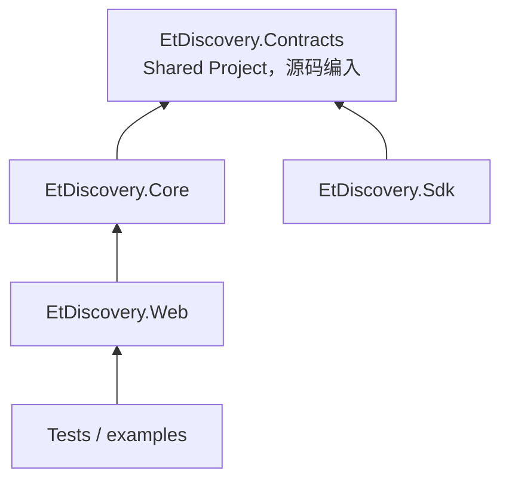
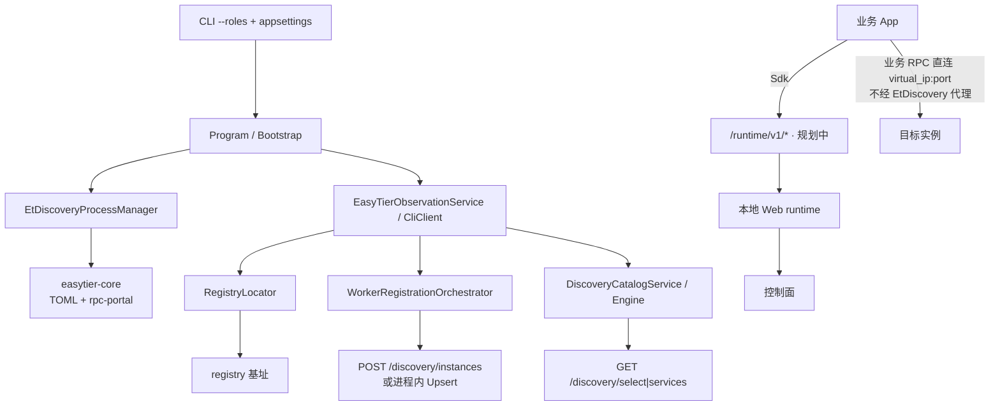

# AGENTS.md — EtDiscovery 代码代理指南

面向 **修改本仓库代码的人/智能体**。读完应能：定位模块边界、按约定改逻辑、跑构建测试，并知道文档该写到哪。

| 文档 | 视角 |
| --- | --- |
| **本文** | 代码结构、改哪里、硬约定、快速索引 |
| [`docs/README.md`](./docs/README.md) | 产品定位、场景、设计文档地图 |
| [`README.md`](./README.md) | 新人通读：痛点、类比、最小上手 |

进度与接口勾选的唯一状态源仍是 [`docs/service-registry-plan.md`](./docs/service-registry-plan.md)。

---

## 1. 仓库身份

**本目录是独立 Git 仓库，通过 submodule 挂在 EasyTier 父仓库下。**

| 事实 | 含义 |
| --- | --- |
| 独立仓库 | 远程一般为 `easytier-discovery`；有自己的 commit 历史、issue、发布节奏 |
| Submodule 路径 | 父仓中通常为 `etdiscovery/`；在父仓内 `cd etdiscovery` 后按 **本仓** 规则工作 |
| 与 EasyTier **代码独立** | 不引用父仓 crate、不共享 Cargo/构建图；本仓是 **.NET** 解决方案 |
| 为何放在一起 | **仅方便对照** EasyTier 的组网/观测/node_type 实现与设计笔记，不是 monorepo 一体化工程 |
| 改父仓 vs 本仓 | EasyTier 虚拟组网 → 改父仓；服务注册发现/选择/SDK → 改 **本仓** |

**禁止假设：**

- 不要把 `../easytier` 或 `../../easytier` 当作本仓编译依赖。
- 不要在本仓文档里把父仓路径写成“本仓库源码树的一部分”。
- 父仓中的 `easytier/docs/route_peer_node_type_flags.md`、`easytier-research.md` 只是 **旁路参考**；本仓自有约定以本仓代码与 `docs/` 为准。

技术栈：**.NET**，当前目标框架见各 `.csproj`，原型为 `net10.0`；ASP.NET Core Web 宿主；可选 Docker/K8s。底层组网进程：`easytier-core` / `easytier-cli`，外部二进制，由 Web 托管启动。

---

## 2. 项目结构

```text
etdiscovery/                          # 本 Git 仓库根，submodule 检出点
├── EtDiscovery.slnx                  # 解决方案
├── EtDiscovery.Contracts/            # Shared Project：线缆/SDK 可见模型，无独立 DLL
│   └── Models/                       # ServiceInstance、SelectedInstance、NodeRole…
├── EtDiscovery.Core/                 # 纯逻辑：引擎、策略、宿主内部模型
│   ├── Abstractions/                 # IDiscoveryResolver、IServiceSelectionPolicy…
│   ├── Models/                       # Snapshot、Catalog、NodeTypeFlags、RuntimeOptions
│   └── Services/                     # DiscoveryEngine、DiscoveryRuntime、默认策略
├── EtDiscovery.Web/                  # 可执行宿主 + 控制面 HTTP + EasyTier 进程
│   ├── Program.cs                    # DI 组装与启动
│   ├── EtDiscoveryWebBootstrap.cs    # --roles / 配置加载
│   ├── EtDiscoveryWebOptions.cs      # 运行时选项
│   ├── Controllers/                  # HTTP 面
│   │   ├── Discovery/                # /discovery/* 控制面
│   │   ├── HealthController.cs
│   │   ├── EasyTierController.cs
│   │   └── TestController.cs
│   └── Services/                     # 编排：注册、定位 registry、观测、进程
├── EtDiscovery.Sdk/                  # 业务薄客户端：AddEtDiscovery / UseEtDiscovery
│   ├── Client/                       # HTTP 调本地 runtime
│   ├── Hosting/                      # DI + 心跳 HostedService
│   └── Options/
├── EtDiscovery.Tests/                # Core + Web 逻辑测试，尽量不依赖真网
├── EtDiscovery.Sdk.Tests/            # SDK HTTP 路径 mock 测试
├── examples/                         # ServiceA/B：仅 SDK DI 骨架
├── docker/ + Dockerfile              # Linux 镜像、entrypoint、K8s 样例
└── docs/                             # 设计与进度，产品/架构视角
```

### 2.1 项目依赖关系



- **Contracts**：`*.shproj` + `*.projitems`，**没有**独立程序集；改模型会同时影响 Core 与 Sdk。
- **Core**：不依赖 ASP.NET、不依赖 EasyTier 进程；策略与 `DiscoveryEngine` 可单测。
- **Web**：唯一默认可运行宿主；托管 EasyTier、暴露 `/discovery/*`，后续补 `/runtime/v1/*`。
- **Sdk**：只谈 **本地 runtime** 的 `RuntimeEndpoint`，不直连远端 registry 控制面。

### 2.2 关键类型速查

| 意图 | 优先打开 |
| --- | --- |
| 启动参数 / 配置节解析 | `EtDiscovery.Web/EtDiscoveryWebBootstrap.cs`、`EtDiscoveryWebOptions.cs` |
| DI 与后台循环注册 | `EtDiscovery.Web/Program.cs` |
| 控制面 HTTP 路径/响应 | `EtDiscovery.Web/Controllers/Discovery/*` |
| 内存实例目录 upsert/查询 | `EtDiscovery.Web/Services/DiscoveryInstanceRegistry.cs` |
| Worker 向 registry 注册 | `WorkerRegistrationOrchestrator.cs` + `WorkerRegistrationBackgroundService.cs` |
| 如何找到 registry | `RegistryLocator.cs`：候选 → route metadata → `GET /discovery/registry` |
| EasyTier TOML / 进程生命周期 | `EasyTierConfigGenerator.cs`、`EtDiscoveryProcessManager.cs` |
| peer/route 观测 → 快照 | `EasyTierCliClient.cs`、`PeerObservationMapper.cs`、`EasyTierObservationService.cs` |
| 目录刷新 / 选择消费观测 | `DiscoveryRefreshBackgroundService.cs`、`DiscoveryCatalogService.cs`、`RegistrySnapshotBuilder.cs` |
| 纯选择与 catalog 内核 | `EtDiscovery.Core/Services/DiscoveryEngine.cs` |
| 节点过滤 / 负载策略 | `ReachableNodeProcessingPolicy.cs`、`RoundRobinServiceSelectionPolicy.cs` |
| 角色 → EasyTier `node_type_*` | `EtDiscovery.Core/Models/EtDiscoveryNodeTypeFlags.cs` |
| 线缆 DTO / 业务可见模型 | `EtDiscovery.Contracts/Models/*` |
| 业务进程接入 | `EtDiscovery.Sdk/**` + `examples/**` |

### 2.3 运行时数据流



角色：`registry` 为目录控制面，`worker` 发布，`client` 发现选择。同一进程可组合；**互调需显式 `worker,client`**，worker 不隐含 client。

---

## 3. 代码与行为硬约定

改代码时默认遵守；与设计文档冲突时以 **已实现代码 + plan 进度表** 为准，再回写文档。

### 3.1 分层边界

| 层 | 做 | 不做 |
| --- | --- | --- |
| EasyTier 进程 | 虚拟 IP、打洞、relay、route 元数据 | 服务目录语义 |
| Web runtime | 托管/观测 EasyTier、registry 定位、控制面、本地 `/runtime/v1`（规划中） | 业务 RPC 代理 |
| Core | 快照→catalog→select 纯逻辑 | IO、HTTP、进程 |
| Sdk | 调本地 runtime、心跳意图 | bootstrap、直连远端 registry、管理 EasyTier |
| 业务进程 | 身份、端口、真正 RPC | worker 运维职能 |

### 3.2 配置与角色

1. **`--roles` / `ETDISCOVERY_ROLES` 必填**（`registry` / `worker` / `client`，逗号组合）。  
2. 配置分节：`EtDiscovery` vs `EasyTier`；**`EasyTier.Peers` 只是入网种子，不是 registry 列表**。  
3. 显式 registry 列表字段：**`RegistryCandidates`**；旧名 `RegistryPeer` 仅过渡兼容，新代码/新配置不要写。  
4. **角色元数据只由 roles 推导** → `node_type_app_id` / `node_type_flags`；**禁止**配置覆盖或接受外部手写覆盖。编解码见 `EtDiscoveryNodeTypeFlags`。  
5. Registry 元数据 HTTP 路径固定：**`GET /discovery/registry`**；**不要**再引入或文档化 `/.well-known/etdiscovery`。  
6. **Mode**（`sidecar` \| `daemon` \| `embedded`；旧 `standalone`→`embedded`）：决定是否捆绑托管 EasyTier；契约见 `docs/service-registry-app-runtime-interaction.md`。Web 侧 mode 驱动托管策略可能尚未完全实现——以 plan 勾选为准。

### 3.3 运维与联调约束

详细排查步骤仍在 runbook；下列是 **实现与改配置时不得破坏** 的约束：

1. **含 `registry` 时 `EtDiscovery:ListenUrl` 必须对虚拟网可达**，如 `http://0.0.0.0:8080`。禁止仅 loopback；启动逻辑会校验。纯 worker/client 可绑本机。  
2. **生成 TOML 必须有 listeners**：`Listeners` 为空时写默认 11010 系；仅 `-c` 时 CLI **不会**再 merge 默认 network 选项。  
3. **Windows 本机 VIP**：需要管理员时用嵌入 manifest 的 `EtDiscovery.Web.exe`；`dotnet xxx.dll` 不触发 UAC。  
4. **Linux VIP**：需要 TUN 及常见 `NET_ADMIN`。容器/K8s 验证约定：真实 Linux、优先 K8s、kube-proxy 内核模式。  
5. **`worker + dhcp`** = EasyTier 自动选本机 VIP，**不是** registry 充当传统 DHCP 服务器。  
6. 同机多实例建议不同 `EasyTier:InstanceName`，避免 CLI `-n` 混淆。  
7. 实例绑定 **虚拟 IP + port + protocol**；控制面候选通常要求同网且 VIP 落在 `VirtualNetworkCidr`。

### 3.4 应用与 Runtime 契约

权威正文：`docs/service-registry-app-runtime-interaction.md`。

- 业务不直连远端 registry、不跑 bootstrap、不管理 EasyTier。  
- 存活真相源是业务 **ActiveHeartbeat**，规划中；runtime 存活 ≠ 实例 Healthy。  
- 控制面前缀 `/discovery/*` 给 registry；本地应用契约 `/runtime/v1/*` 按 worker/client 分能力。**服务端可能未实现**，Sdk 已按契约编码时不要“顺手”改成直连控制面。

### 3.5 实现风格

- 新语义 API 的进度只在 **plan** 勾选；应用层文档写语义，不写“已完成/未完成”双份表。  
- Core 保持可单测；需要网络/进程的逻辑放 Web。  
- 占位接口可返回固定/空实现，但 **路径与模型名** 与应用层文档对齐后再改。  
- 不要引入第二套“谁是 registry”的启发式（尤其禁止“第一个 peer 即 registry”）。

---

## 4. 文档职责与编写规范

### 4.1 写到哪

| 内容 | 落点 |
| --- | --- |
| 产品痛点、类比、快速上手 | 根 `README.md` / `README_EN.md`，保持短 |
| 场景展开、设计阅读顺序 | `docs/README.md` |
| 长期稳定的角色/实体/状态机/算法 | `docs/service-registry-core-design.md` |
| HTTP/SDK 语义、Mode、框架集成 | `docs/service-registry-application-layer.md` |
| 业务与本地 runtime 契约 | `docs/service-registry-app-runtime-interaction.md` |
| 如何定位 registry | `docs/service-registry-bootstrap-discovery.md` |
| **进度、限制、阶段、下一步** | `docs/service-registry-plan.md`，**唯一**进度源 |
| 启动与平台排查步骤 | `docs/service-registry-prototype-validation.md` |
| 未冻结分歧 | `docs/service-registry-open-questions.md` |
| 第三方系统摘要 | `docs/service-registry-references*.md` |
| 代码结构、代理约定、改哪里 | **本文 AGENTS.md** |

### 4.2 编写规则

1. **一篇一主题**；新主题优先新文件，不把 plan/runbook/API thrash 进 references。  
2. **进度只写 plan**；设计文写目标与语义，不维护第二份完成度清单。  
3. **references** 只写第三方机制 + 链接 + 中性对照；不写本仓 HTTP 定稿、不写 backlog。本仓结论回写设计文。  
4. 根 README **不要**堆运维硬约束全文与长排查表——硬约束写本文 §3；逐步排查写 runbook；plan 只保留进度与回归备忘。  
5. 文档交叉引用用相对路径；**不要**把父仓 EasyTier 路径写成 submodule 内部源码。  
6. 中英 README 语义对齐；深度设计目前以中文 `docs/` 为主时可在英文 README 标明 “details in Chinese docs”。  
7. 变更行为或 API 时：先改代码与测试 → 更新 plan 勾选 → 若语义变了再改应用层/交互/bootstrap。  
8. **图示**：结构/数据流/部署/时序用 **Mermaid**（`flowchart` / `sequenceDiagram` 等）。**除目录树外禁止** ASCII 框线、制表符拼图或 `┌─┐`/`──►` 类示意图；命令与 API 样例用 `bash` / `http` / `json` 代码块，不要用“伪图”。目录树可用 `text` 缩进树。  
9. **括号**：标题与表头避免无信息量的括注，如“通读版”“摘要”“现象”。括号仅用于较短注意、取值样例或状态备注，如 `http://0.0.0.0:8080`、`规划中`。

### 4.3 建议阅读路径

| 任务 | 顺序 |
| --- | --- |
| 改注册/选择逻辑 | 本文 §2 → Core Engine/策略 → Web Catalog/Registry 服务 → 对应 Tests |
| 改 bootstrap / 找 registry | 本文 + bootstrap 设计 → `RegistryLocator` → plan §2.3 |
| 改 HTTP API | 应用层 API 表 → Controllers → plan 接口清单 |
| 改 Sdk / 示例 | 交互契约 → Sdk → examples；确认 Web `/runtime/v1` 是否已实现 |
| 改 EasyTier 托管 | `EasyTierConfigGenerator` / `EtDiscoveryProcessManager`；对照父仓文档仅作参考 |
| 联调排障 | plan §3 → runbook → health/peers 字段 |

---

## 5. 构建、测试与本地运行

```powershell
# 在本仓库根目录 etdiscovery/
dotnet build EtDiscovery.slnx
dotnet test EtDiscovery.Tests/EtDiscovery.Tests.csproj
dotnet test EtDiscovery.Sdk.Tests/EtDiscovery.Sdk.Tests.csproj

dotnet run --project EtDiscovery.Web -- --roles registry
dotnet run --project EtDiscovery.Web -- --roles worker
```

容器，优先真实 Linux 与 Kubernetes：

```bash
docker build -t etdiscovery:local .
# ETDISCOVERY_ROLES 必填；ETDISCOVERY_MODE 默认 embedded
# ETDISCOVERY_CONFIG_FILE 或挂载 /config/appsettings.json
# 需要 /dev/net/tun、NET_ADMIN；样例：docker/k8s/registry-sample.yaml
```

最小配置提示：

- Registry：`ListenUrl=http://0.0.0.0:8080`，建议固定 `EasyTier.Ipv4`。  
- Worker：`Services[]`；`RegistryCandidates` 可空以测 route 发现；`Peers` 指向入网点。  

完整 JSON 样例与逐步验证：根 README「早期开发者体验」+ runbook。

---

## 6. 当前实现缺口

权威清单：`docs/service-registry-plan.md`。摘要：

| 已有 | 未有/占位 |
| --- | --- |
| EasyTier 托管、观测、registry 发现 | `/runtime/v1/*` 服务端、Mode 完整托管策略 |
| `/discovery` 注册/查询/select 控制面 | lease/health/status/metadata 完整行为 |
| Contracts + Sdk + examples 骨架 | ActiveHeartbeat TTL 管线、跨服务 example 调用 |
| Docker/K8s registry 样例 | watch、调用反馈、弱网评分、多语言 SDK |

不要在未实现 `/runtime/v1` 时让 Sdk 绕过契约直打控制面并当作长期方案。

---

## 7. 一页速查

| 关键词 | 位置 |
| --- | --- |
| Submodule / 独立仓 | 本文 §1 |
| 解决方案项目 | `EtDiscovery.slnx` |
| 角色 flags | `EtDiscoveryNodeTypeFlags` |
| 找 registry | `RegistryLocator` + bootstrap 文档 |
| 实例目录 | `DiscoveryInstanceRegistry` |
| 选择算法 | `DiscoveryEngine` + `IServiceSelectionPolicy` |
| HTTP 控制面 | `Controllers/Discovery/*` |
| 业务接入 | `EtDiscovery.Sdk` |
| 进度 | `docs/service-registry-plan.md` |
| 产品文档入口 | `docs/README.md` |
| 协议 | `LICENSE`，计划 AGPL-3.0-only |
