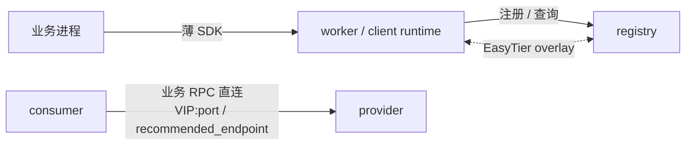

# EasyTier Discovery 设计文档

本文是 `docs/` 的 **产品 / 架构** 入口：能力定位、使用场景、设计文档地图。  

| 你想… | 去哪 |
| --- | --- |
| 快速了解痛点与上手 | 根 [README.md](../README.md) |
| **改代码、找模块、遵守实现约定** | 根 [AGENTS.md](../AGENTS.md)，与本文视角不同 |
| 深入设计与 API 语义 | 下文目录 |

---

## 1. 能力定位

### 1.1 一句话

在 EasyTier 提供的 **跨 NAT / 弱网 / 异构节点 overlay** 上，增加 **服务注册、发现、实例选择与弱网调度信号**（后者规划中），让业务在现有 HTTP/gRPC/TCP 栈上直连正确的实例。

### 1.2 分层

| 层 | 职责 | 不负责 |
| --- | --- | --- |
| EasyTier | 虚拟 IP、路由、打洞、relay、链路观测 | 服务目录语义 |
| EtDiscovery control plane | 注册表、registry 发现、选择、健康/租约模型 | 业务 RPC 代理 |
| 薄 SDK / 业务框架 | 查地址、发业务请求、**上报注册/心跳**、反馈 | 管理 EasyTier；复制完整评分状态机 |

### 1.3 与“同类组合”的对应关系

| 能力包 | 类比 | 在本项目中的落点 |
| --- | --- | --- |
| 服务注册 + 发现 | Nacos / Consul | 实例资源模型、`register` / `resolve` / `select`；见 [应用层](./service-registry-application-layer.md) |
| 跨网互联 | EasyTier | 进程托管 + peer/route 观测；见 [Bootstrap](./service-registry-bootstrap-discovery.md)、[参考：EasyTier 能力](./service-registry-references/easytier-capabilities.md) |
| 弱网观察 / 分布式存活 | Orleans 风格 suspect、多观察者 | 状态机与评分设计；见 [核心设计](./service-registry-core-design.md) |
| Actor 类扩展 | Orleans placement（长期） | 仅预留方向，非首版闭环；见 [open questions](./service-registry-open-questions.md) |
| 运行模式 | Dapr | sidecar / daemon / embedded；**仅 embedded 进程内托管 EasyTier**；见 [应用接入](./service-registry-application-layer.md) |

### 1.4 能力清单

| 能力 | 说明 |
| --- | --- |
| 实例注册与下线 | 服务实例绑定 EasyTier 虚拟 IP 与端口；worker 主动上报 |
| 服务发现 | 按服务名（及后续标签/分组）解析候选实例 |
| 健康实例选择 | 返回 `SelectedInstance`（推荐 endpoint + 诊断字段），应用直连 |
| Registry 自动发现 | 入网后不必写死 registry 公网 IP：配置候选 + route 角色元数据 + `GET /discovery/registry` |
| 节点角色元数据 | `registry` / `worker` / `client` 等经 EasyTier `node_type_*` 传播，避免“第一个 peer 就是注册中心” |
| 弱网友好读取语义 | 瞬时快照、最终一致；不为强一致牺牲可用性（见 plan） |
| 调用反馈与评分 | 延迟、错误类型、链路质量进入选择；规划中 |
| 多语言接入 | 薄 SDK 调控制面，不把完整评分/bootstrap 状态机复制到各语言；规划中 |

**明确非目标：**

- 不替代 EasyTier 路由 / 打洞 / relay 实现  
- 不封装、不代理业务 RPC  
- 首版不做 Nacos/Consul 线协议兼容  
- 首版不做多 registry 强一致、完整 Actor placement、正式移动端 SDK  

实现进度以 [实施方案](./service-registry-plan.md) 为准。

### 1.5 最小闭环

---

## 2. 使用场景

下列场景是产品动机，也是设计取舍的依据。细节实现阶段不同；标了“依赖规划能力”的部分见 plan。

### 2.1 生产微服务流量临时切到开发本机

**背景：** Docker / K8s 中某服务难本地完整复现，希望线上（或联调环境）调用落到笔记本进程。

**期望：**

1. 本机 worker 加入与集群相同的 EasyTier 网络，获得虚拟 IP。  
2. 本机以更高权重或唯一实例注册同名服务；旧实例 draining / 下线或被选择策略降权。  
3. 依赖的中间件、数据库仍走原有网络路径（或同样在 overlay 可达）。  
4. 其它服务通过发现拿到本机虚拟 IP 并成功调用。

**EtDiscovery 贡献：** 跨网身份 + 服务级注册发现，而不是“只 VPN 进内网却没有服务目录”。  
**相关文档：** [应用层](./service-registry-application-layer.md)、[Bootstrap](./service-registry-bootstrap-discovery.md)、[核心设计·选择](./service-registry-core-design.md)。

### 2.2 异构架构上的特殊服务

**背景：** 构建或渲染必须在带显卡的 Windows 工作站，如 Unity / GPU CI；难以塞进标准 Linux agent 池。

**期望：**

- 工作站作为 worker 入网并注册 `unity-builder` 一类服务  
- 调度器 / 业务侧通过服务发现找到可用工作站实例  
- 跨网拉代码、推制品、回写状态走业务协议，EtDiscovery 只解决“找哪台、是否在线”

**EtDiscovery 贡献：** 把“不合规节点”变成可发现的服务实例，而不是游离在微服务体系外的人工机器。

### 2.3 本机插件 / 人工 2FA 能力作为服务暴露

**背景：** 能力依赖桌面软件、浏览器插件或人工完成 2FA，无法容器化上云。

**期望：**

- 办公电脑上的 runtime 注册“已登录会话代理”“本地插件桥”等服务  
- 内网或其它 overlay 节点按需调用  
- 机器休眠/掉线后目录中可观测为不可用（依赖健康/租约能力完善后更完整）

**EtDiscovery 贡献：** 服务目录承认“人在环路 / 本机绑定”实例，而不是假定全部无状态云函数。

### 2.4 移动端访问 NAS 与家用设备并感知掉线

**背景：** 手机需要访问家庭 NAS、IoT 或局域网服务，并知道哪些设备离线。

**期望：**

- 家庭侧设备 / NAS 旁 worker 注册服务  
- 移动端以 `client`（或薄封装）加入同一 overlay，查询与选择实例  
- 结合节点/实例健康与网络观测判断掉线（完整体验依赖后续健康与评分）

**EtDiscovery 贡献：** 在“能连回家”之上增加 **服务级目录与在线视图**。  
**说明：** 首版移动端 SDK 仅预留模型，见 [应用接入·移动端](./service-registry-application-layer.md#105-移动端边界)。

### 2.5 防火墙白名单环境下的安全接口调试

**背景：** 私有云或对端 API 仅允许固定出口 IP；开发者家庭宽带 IP 常变。

**期望：**

- 调试流量经已在白名单内的节点或稳定 overlay 路径到达对端  
- 本机调试进程仍作为可发现服务接入联调拓扑  
- 减少为个人调试反复改安全策略

**EtDiscovery 贡献：** 把“调试入口”纳入统一注册发现与虚拟网络身份，而不是每人一条临时端口映射。

### 2.6 场景 → 设计要点对照

| 场景 | 关键设计要点 |
| --- | --- |
| 流量切本机 | 实例多活、权重/状态、选择策略；跨网 VIP |
| 异构 CI / 工作站 | 任意节点可当 worker；registry 不绑机房 |
| 本机插件 / 2FA | 实例生命周期跟机器与人；租约与掉线语义 |
| 移动 + 家用设备 | client 角色、弱网、掉线可观测 |
| 白名单私有云 | overlay 身份稳定；控制面与业务直连分离 |

---

## 3. 文档目录

### 3.1 设计主线

| 顺序 | 文档 | 读什么 |
| --- | --- | --- |
| 1 | **本文** | 定位、场景、目录 |
| 2 | [核心设计](./service-registry-core-design.md) | 目标边界；Mode / NodeRole / CapabilityFlags；实体；健康状态机；评分与选择算法 |
| 3 | [应用接入（SDK / Runtime / API）](./service-registry-application-layer.md) | **唯一**接入契约：硬约束、Mode、ActiveRenewal、HTTP 全表、配置、部署、框架集成 |
| 4 | [Registry Bootstrap Discovery](./service-registry-bootstrap-discovery.md) | 为何 peer ≠ registry；候选优先级；配置模型；`GET /discovery/registry`；启动流程 |

### 3.2 进度、验证与分歧

| 文档 | 读什么 |
| --- | --- |
| [实施方案与阶段计划](./service-registry-plan.md) | **唯一**进度源；接口已实现/占位；阶段与下一步 |
| [原型验证 Runbook](./service-registry-prototype-validation.md) | Windows/Linux 启动、权限、排查字段与推荐路径 |
| [待讨论问题](./service-registry-open-questions.md) | 未冻结分歧：语言形态、registry 职责上限、评分可配置度等 |

### 3.3 参考资料

第三方摘要，非本仓库定稿。

| 文档 | 读什么 |
| --- | --- |
| [参考资料索引](./service-registry-references.md) | 第三方摘要目录 |
| [EasyTier 可复用能力](./service-registry-references/easytier-capabilities.md) | 网络/NAT/relay/观测/嵌入能力清单 |
| [外部系统概览](./service-registry-references/external-systems-overview.md) | ZooKeeper / Nacos / Consul / Eureka / K8s / Orleans |
| [应用层接口风格](./service-registry-references/application-integration-patterns.md) | gRPC / Spring / Dubbo 边界 |
| [Bootstrap 与 Membership 参考](./service-registry-references/bootstrap-and-membership-models.md) | DHCP / Serf / xDS / DNS SRV 等 |
| [对照表](./service-registry-references/comparison-matrix.md) | 系统 × 机制速查 |

### 3.4 旁路参考

以下文件属于 **父仓 / 并列检出** 时的对照材料，**不是** etdiscovery 仓库源码。无父仓时忽略即可。

| 文档 | 读什么 |
| --- | --- |
| EasyTier `docs/route_peer_node_type_flags.md`（父仓） | node type flags 字段草案 |
| EasyTier 仓库研究笔记（父仓根） | 仓库级研究 |
| [根 README](../README.md) | 新人通读 |
| [AGENTS.md](../AGENTS.md) | 代码结构与贡献约定 |

文档写到哪、一篇一主题等 **编写规范** 见 [AGENTS.md §4](../AGENTS.md#4-文档职责与编写规范)。

---

## 4. 当前状态

详情只维护在 [plan](./service-registry-plan.md)；实现缺口速览见 [AGENTS.md §6](../AGENTS.md#6-当前实现缺口)。

- 可执行宿主：**`EtDiscovery.Runtime`**（独立进程）  
- **契约已纠偏并合并为一篇** [应用接入](./service-registry-application-layer.md)  
- Sdk/examples 仍为过时 `/runtime/v1` 骨架；Mode 未实现  
- 未完成：Mode、Sdk 改控制面、去掉无 Sdk 代注册 Healthy、watch、反馈、评分  

---

## 5. 建议阅读路径

**产品 / 架构通读：** 根 README → 本文 §1–2 → 核心设计 §1–4 → [应用接入](./service-registry-application-layer.md) §1–5  

**动手改代码：** [AGENTS.md](../AGENTS.md) → plan → 对应设计专题  

**实现联调：** plan → Runbook → Bootstrap 配置模型  

**做 API / SDK：** [应用接入](./service-registry-application-layer.md) → plan 接口清单  
