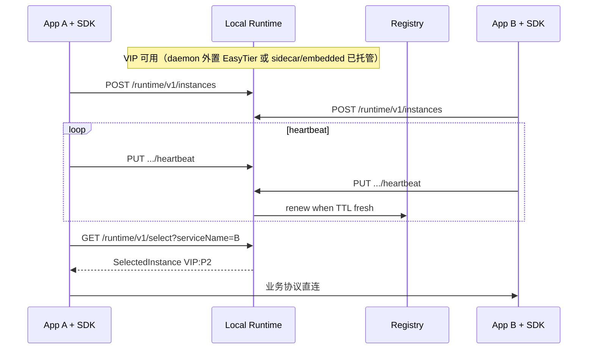

# 应用进程 ↔ 本地 Runtime 交互

本文档是 **业务进程与 EtDiscovery 本地 runtime** 的交互契约与部署结论（权威）。  
实现进度见 [实施方案](./service-registry-plan.md)。

相关文档：

- 分层与 API 总表：[应用层与集成](./service-registry-application-layer.md)
- 角色与 Mode 模型：[核心设计](./service-registry-core-design.md)
- Registry 定位：[Bootstrap](./service-registry-bootstrap-discovery.md)

---

## 1. 硬约束

| # | 约束 | 含义 |
| --- | --- | --- |
| C1 | **业务不碰 worker 职能** | bootstrap、VIP/nodeId、远端 register/renew、EasyTier 观测等由本地 runtime（及 SDK 对 runtime 的封装）完成。业务只表达「我是谁 / 提供什么 / 要调谁」。主路径为薄 SDK；无 SDK HTTP 仅运维/调试。 |
| C2 | **存活真相源是业务进程** | 实例健康与租约以业务进程 **ActiveHeartbeat** 为准（本版不做端口被动探测）。runtime 存活 ≠ 业务实例 Healthy。 |
| C3 | **一节点一 VIP 多服务** | 同一 EasyTier 虚拟 IP 上可有多个实例，以 `port + protocol` 区分，并可同 NS 互调。 |
| C4 | **互调必须双角色** | 本机 runtime 须显式 **`worker,client`**。仅 worker 可发布不可 select；仅 client 可消费不可发布。worker **不**隐含 client。 |

---

## 2. 三层边界

| 层 | 职责 |
| --- | --- |
| **应用进程** | 业务身份、监听端口、心跳/注册意图（SDK）、真正发业务 RPC |
| **本地 runtime**（`EtDiscovery.Web`） | registry 定位、目录代理、本地 `/runtime/v1`、选择/缓存、按 **mode** 决定是否捆绑 EasyTier、附 nodeId/VIP 后写控制面 |
| **Registry 控制面** | 目录聚合、注册写入、跨节点视图、租约/健康汇总 |

- runtime **不**代理业务 RPC 正文。  
- 业务 **不**直连远端 registry、不跑 bootstrap、不管理 EasyTier。

---

## 3. Mode 与 NodeRole

### 3.1 Mode（启动必传）

参数：`--mode` / `ETDISCOVERY_MODE` / `EtDiscovery:Mode`  
取值：**`sidecar` | `daemon` | `embedded`**  
旧名 `standalone` → **`embedded`**。

| mode | 含义 | EasyTier |
| --- | --- | --- |
| **`daemon`** | 同 NS 内多业务共享一个 EtDiscovery 宿主 | **不捆绑、不托管**；隧道由运维 **外置独立进程** 提供并共享 |
| **`sidecar`** | 与业务就近旁路（典型同 Pod） | **捆绑托管**（与 sidecar 同生共死） |
| **`embedded`** | runtime 与宿主一体（业务内嵌，或本进程即 EtDiscovery，含原 standalone） | **捆绑托管**；**registry+embedded 必须捆绑** |

- **`daemon` ≠ Kubernetes DaemonSet**（DaemonSet 只是可选载体）。  
- 同一大集群可部署 **多套** 独立业务系统，各用独立 `NetworkName` / Secret / CIDR / daemon 或 sidecar。  
- 角色 × mode 场景矩阵见 **§9**（文档约束；代码不做组合校验）。

### 3.2 NodeRole

- `registry` / `worker` / `client` / … 表达职责；能力按角色并集。  
- **含 `registry`**：mode 仅 `daemon` 或 `embedded`；**集群（K8s）registry 使用 `embedded`**。  
- **互调**：runtime `--roles worker,client`。

### 3.3 生命周期（摘要）

| 事件 | `daemon` | `sidecar` | `embedded` |
| --- | --- | --- | --- |
| 业务 App 启停 | 只连 runtime；心跳/注册；**不**动外置 EasyTier | 随 Pod/sidecar 策略 | 随宿主进程 |
| 停 EtDiscovery | 发现面失效；**默认不停**外置 EasyTier | 停 sidecar = 停其 EasyTier | 停进程 = 停其 EasyTier |
| 停 EasyTier | 运维显式停外置 unit | 通常随 EtDiscovery | 通常随 EtDiscovery |

**daemon 部署顺序：** 外置 EasyTier（VIP 就绪）→ EtDiscovery `--mode daemon` → 业务 App（SDK）。  
**sidecar / embedded：** 启动 EtDiscovery（内嵌托管 EasyTier）→ 业务或控制面就绪。

---

## 4. API 面

| 面 | 前缀 | 暴露 | 门禁 |
| --- | --- | --- | --- |
| 控制面 | `/discovery/*` | registry（overlay/VIP 可达） | `registry` 角色 |
| 本地应用契约 | `/runtime/v1/*` | 同 NS 内 App / SDK | `worker` / `client` 分能力 |

### 4.1 本地契约（`/runtime/v1`）

| 方法 | 路径 | 角色 | 说明 |
| --- | --- | --- | --- |
| GET | `/runtime/v1/select` | `client` | 选择一个健康实例 |
| GET | `/runtime/v1/resolve` | `client` | 列候选 |
| POST | `/runtime/v1/instances` | `worker` | 本机实例声明（runtime 注入 nodeId/VIP） |
| DELETE | `/runtime/v1/instances/{id}` | `worker` | 注销 |
| PUT | `/runtime/v1/instances/{id}/heartbeat` | `worker` | 业务心跳（存活） |
| POST | `/runtime/v1/report` | `client` | 调用反馈（后续） |

- SDK 只配置 `RuntimeEndpoint`（默认 `http://127.0.0.1:8081`）。  
- 纯 worker/client 的 `ListenUrl` 建议 loopback；含 `registry` 时控制面禁止仅 loopback。

### 4.2 控制面

保持现有 `/discovery/*`（注册表、select、services、registry 元数据等）。runtime 内部可读控制面或缓存；**应用不直连控制面**。

---

## 5. 注册与实例身份

| 模式 | 谁声明 | 谁写 registry |
| --- | --- | --- |
| 配置清单 | runtime `Services[]`（可选元数据） | worker 路径上报 |
| SDK/业务 | `POST /runtime/v1/instances` | runtime 代理 |

- 存活：**仅** SDK/业务心跳（或等价 ActiveHeartbeat）驱动 renew；无心跳则不得维持 Healthy。  
- 默认 `instance_id = {nodeId}:{serviceName}:{protocol}:{port}`。  
- 同 VIP：`port + protocol` 区分多服务。

---

## 6. 存活（ActiveHeartbeat）

```text
App/SDK:  register → 周期 heartbeat → 下线 deregister
Runtime:  收到 heartbeat 则刷新 TTL 并 renew 控制面；TTL 过期则停 renew / Unhealthy
```

| 参数 | 建议 |
| --- | --- |
| SDK 心跳间隔 | 5s |
| ttl_healthy | 约 15–30s |

辅助信号（网络、peer、调用反馈）影响评分，**不**单独替代心跳。

---

## 7. 配置拆分

### 7.1 Runtime 运维配置（仅 EtDiscovery.Web）

**必填：** `Mode`、`Roles`、`NetworkName`、`NetworkSecret`、`VirtualNetworkCidr`、`ListenUrl`、`DiscoveryPort`、EasyTier 二进制与实例名等。

**按场景：** VIP/DHCP/Peers；worker 的 registry 候选或自动发现；可选 `Services[]`。

**下发：** 主机配置 / ConfigMap + **Secret**（秘钥）。镜像 registry 默认 `Mode=embedded`。

**`daemon`：** EasyTier 使用 **独立** 运维 unit/配置；EtDiscovery 只保留观测/连接所需项。  
**`sidecar` / `embedded`：** EasyTier 参数可挂在同一 runtime 配置并由进程托管。

### 7.2 业务 SDK 配置（每个 App）

**允许：** `RuntimeEndpoint`、`ServiceName`、`Port`、`Protocol`、`InstanceId`、心跳间隔、tags/version/group 等。

**禁止：** `NetworkName`/`NetworkSecret`/CIDR、全部 `EasyTier:*`、`Mode`/`Roles`、`RegistryCandidates`、远端 registry URL、runtime 的 `ListenUrl`、自启 easytier。

```json
{
  "EtDiscovery": {
    "RuntimeEndpoint": "http://127.0.0.1:8081",
    "ServiceName": "order-api",
    "Port": 9001,
    "Protocol": "http",
    "HeartbeatInterval": "00:00:05"
  }
}
```

---

## 8. SDK 与代码组织

### 8.1 项目

| 项目 | 产出 | 职责 |
| --- | --- | --- |
| `EtDiscovery.Contracts` | Shared Project（无 DLL） | 线缆/业务可见模型（namespace `EtDiscovery.Core.Models`） |
| `EtDiscovery.Core` | DLL | 引擎、策略、进程内抽象、宿主元数据 |
| `EtDiscovery.Sdk` | DLL | 本地 runtime HTTP 客户端 + DI/心跳 |
| `EtDiscovery.Web` | 宿主 | 控制面、bootstrap、mode 与 EasyTier、目录 |

```text
[业务 App] → EtDiscovery.Sdk → EtDiscovery.Web → Core 引擎 +（按 mode）EasyTier
```

业务 **只引用 Sdk**。

### 8.2 .NET API

| API | 作用 |
| --- | --- |
| `services.AddEtDiscovery(IConfiguration \| Action<EtDiscoveryClientOptions>)` | 注册 options、`HttpClient`、`IEtDiscoveryClient`、心跳 `IHostedService` |
| `app.UseEtDiscovery()` | 校验已注册 |
| `EtDiscoveryClientFactory.Create(...)` | 非 DI |

`IEtDiscoveryClient`：`RegisterAsync` / `HeartbeatAsync` / `DeregisterAsync` / `SelectOneAsync` / `ResolveAsync`  
对应 HTTP 见 §4.1。

```csharp
builder.Services.AddEtDiscovery(builder.Configuration.GetSection("EtDiscovery"));
var app = builder.Build();
app.UseEtDiscovery();
// 业务路由；select 后用业务栈直连 virtual_ip:port
```

### 8.3 示例

`examples/EtDiscovery.Examples.ServiceA|B`：演示 `Add`/`Use` 与瘦配置；跨服务业务调用为后续示例内容。

---

## 9. 角色 × mode 与经典部署

图例：**推荐** / **注意** / **不可用**（文档约束，代码不校验组合）。

### 9.1 常用组合

| 组合 \ mode | `daemon` | `sidecar` | `embedded` |
| --- | --- | --- | --- |
| `registry` | 注意（非集群；EasyTier 外置） | 不可用 | **推荐**（集群；捆绑 EasyTier） |
| `worker,client` | **推荐**（VM/同 NS 多服务） | **推荐**（K8s 一业务一旁路） | 注意 |
| `worker` 或 `client` 单独 | 推荐（按职责） | 推荐 | 注意 |

### 9.2 拓扑

| 场景 | 选择 |
| --- | --- |
| VM 多业务同主机 NS | `daemon` + `worker,client`；EasyTier 外置 |
| K8s 一业务一 Pod | `sidecar` + `worker,client` |
| K8s registry | `embedded` + `registry`；捆绑 EasyTier |
| K8s 同 Pod 多业务 | 共享一个 EtDiscovery（daemon 语义）；单 EasyTier |
| 同大集群两套业务系统 | 两套网络配置 + 各自 runtime |
| 默认 CNI 下「节点 VIP 注册普通 Pod 端口」 | **不可用**（VIP 与监听须同 NS） |

### 9.3 经典选型

| 场景 | roles | mode | EasyTier |
| --- | --- | --- | --- |
| A. K8s 注册中心 | `registry` | `embedded` | 捆绑 |
| B. K8s 微服务 | `worker,client` | `sidecar` | 捆绑 |
| C. VM 多进程互调 | `worker,client` | `daemon` | 外置 |
| D. 进程内嵌 | `worker` 和/或 `client` | `embedded` | 捆绑（默认） |

### 9.4 Daemon 同 NS 互调形状

```text
  EasyTier (外置)          VIP = 10.x.x.N
  EtDiscovery --mode daemon --roles worker,client
  AppA:P1  AppB:P2
  App → SDK → /runtime/v1/select → 业务直连 VIP:port
```

---

## 10. 调用序列（契约）



---

## 11. ListenUrl

| 角色 | ListenUrl |
| --- | --- |
| 含 `registry` | 非 loopback（如 `0.0.0.0`） |
| 仅 worker/client | 建议 `http://127.0.0.1:…`（同 NS SDK） |

---

## 12. 文档维护

- 进度与接口实现状态：只写在 [plan](./service-registry-plan.md)。  
- Mode / 角色模型细节：[核心设计](./service-registry-core-design.md)。  
- HTTP 全表与框架集成：[应用层](./service-registry-application-layer.md)。  
- 本文只维护 **契约与部署结论**，不记录历史冲突与差距清单。
