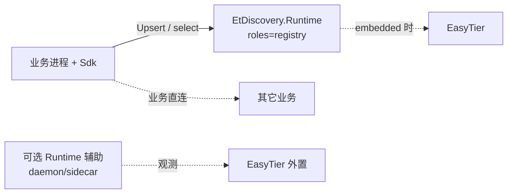
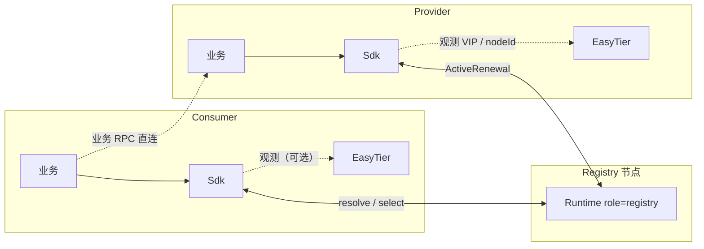
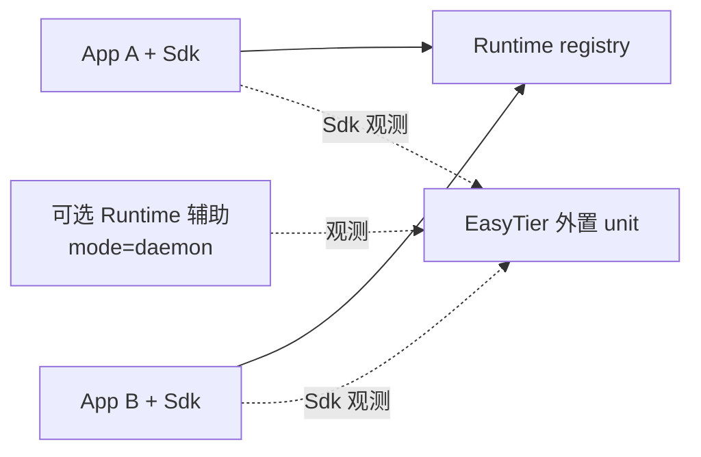
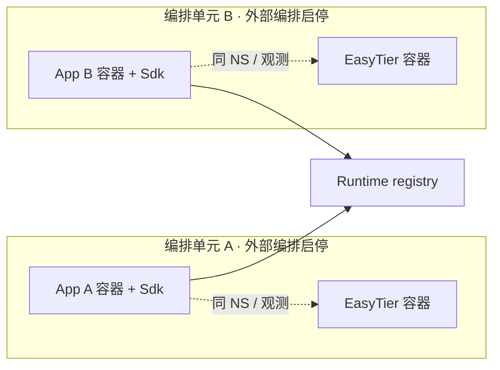
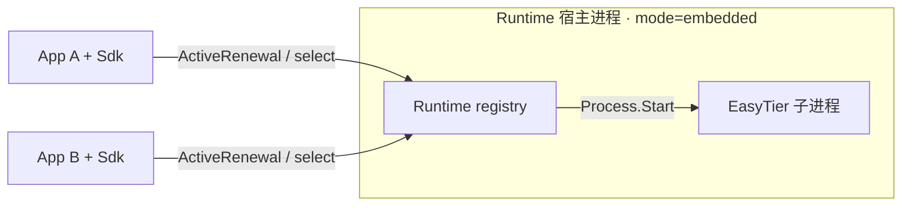
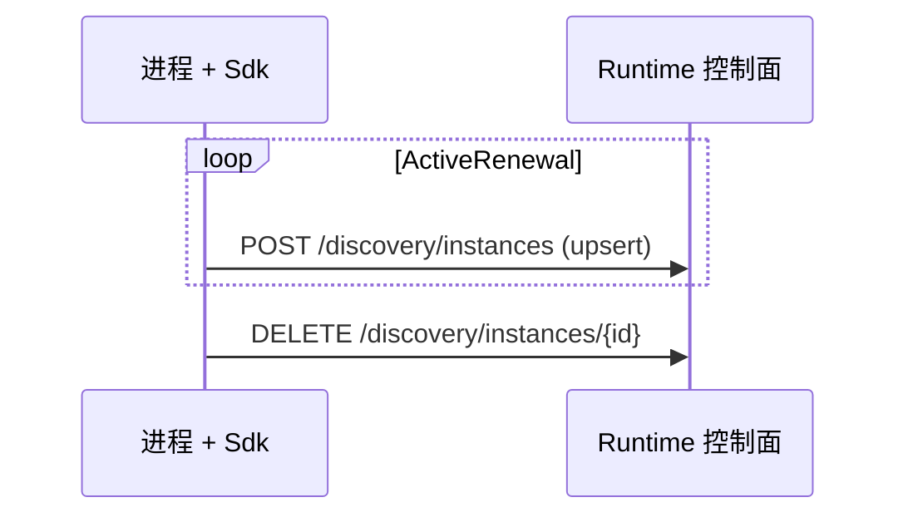
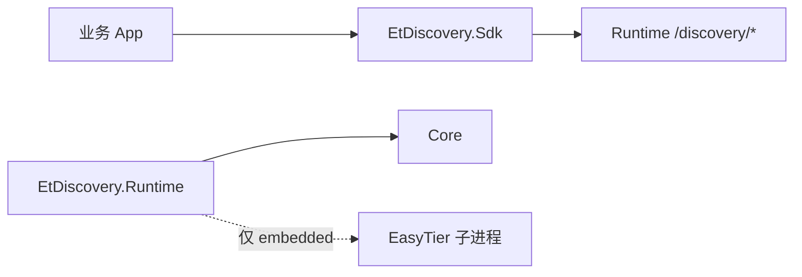
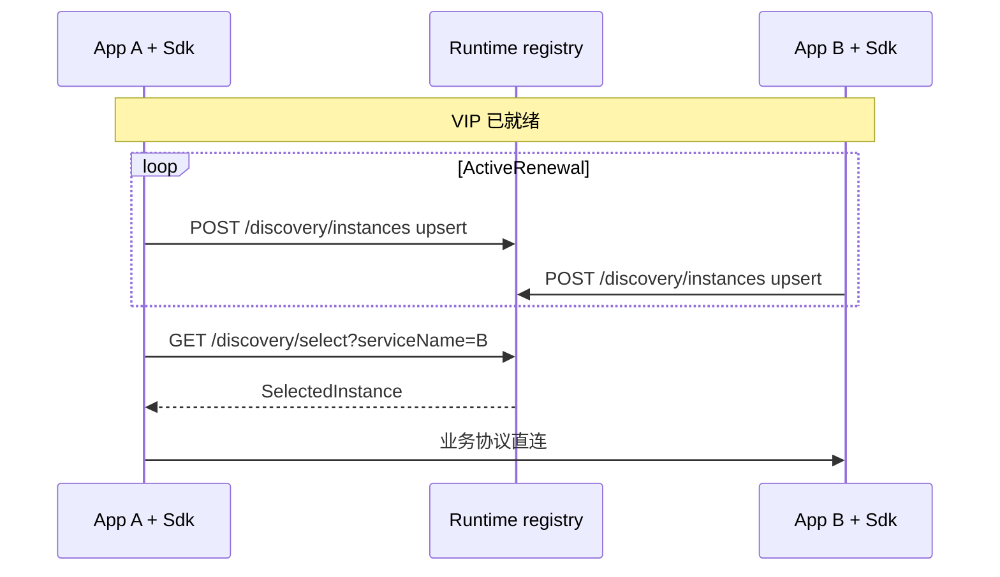

# 应用接入：SDK、Runtime 与 API

本文档是 **应用如何接入 EtDiscovery** 的 **唯一权威**说明，涵盖：

- 硬约束与组件边界（业务 / Sdk / Runtime）
- Mode 与 EasyTier 生命周期
- 控制面 API、ActiveRenewal、配置拆分
- 部署选型、.NET SDK 组织
- SelectedInstance、框架集成与移动端边界

实现进度与接口勾选只写在 [实施方案](./service-registry-plan.md)。  
角色算法与健康状态机见 [核心设计](./service-registry-core-design.md)。  
Registry 自动发现协议见 [Bootstrap](./service-registry-bootstrap-discovery.md)。

> **说明：** 原 `service-registry-app-runtime-interaction.md` 已并入本文；[该路径](./service-registry-app-runtime-interaction.md) 仅作跳转 stub。

---

## 0. 与错误草案的差异（必读）

| 废止内容 | 定稿 |
| --- | --- |
| 主路径 = Sdk → 本地 **`/runtime/v1`** → Runtime **代理** register/renew | 主路径 = **业务进程 + Sdk 直接调用控制面** |
| sidecar = EtDiscovery **进程内** `Process.Start` 托管 EasyTier | sidecar = **编排层**同生死；默认 **不**子进程托管 core |
| Runtime / `Services[]` 代注册维持 Healthy | **禁止**冒充；Healthy 仅来自 **持有 Sdk 的进程** 的 ActiveRenewal |
| Mode **启动必传** | Mode **可省略，默认 `daemon`**；registry 镜像显式 `embedded` |
| 宿主项目名 `EtDiscovery.Web` | 现为 **`EtDiscovery.Runtime`** |

已落地 Sdk 若仍指向 `/runtime/v1`，属 **过时骨架**（见 plan）。

---

## 1. 定位与硬约束

### 1.1 应用层做什么 / 不做什么

**负责：**

- 统一的注册与发现接口（经 Sdk）
- 返回「可调用实例 + 推荐调用方式」
- 将业务调用反馈回写调度层（规划中）

**不负责：**

- 代理业务 RPC
- 接管业务重试策略
- 伪装成 Nacos/Consul 等线协议兼容层

**一句话：**

- **`EtDiscovery.Runtime` 独立进程**承载 registry 控制面  
- **薄 Sdk** 提供 worker/client（ActiveRenewal + 选点）  
- 业务调用链：**Sdk 查地址 → 原栈直连 VIP:port**

### 1.2 硬约束

| # | 约束 | 含义 |
| --- | --- | --- |
| C1 | **业务不碰组网与 bootstrap 启发式** | 不管理 EasyTier 进程、不手写「谁是 registry」启发式、不复制评分状态机。 |
| C2 | **存活真相源 = 持有 Sdk 的进程** | 实例健康与租约以该进程周期 **ActiveRenewal** 为准（见 §5）。本版不做端口被动探测。 |
| C2b | **禁止代理冒充健康** | 独立 Runtime **不得**仅凭自身存活或 `Services[]` 周期 upsert 将**他人业务**实例维持为 Healthy。 |
| C3 | **一节点一 VIP 多服务** | 同 VIP 上以 `port + protocol` 区分多实例，可同 NS 互调。 |
| C4 | **持有 Sdk ⇔ worker / client** | 发布与消费只能由 **引用 Sdk 的进程** 实现；worker **不**隐含 client。 |
| C5 | **registry 只在独立 Runtime** | `registry` 仅允许在 **`EtDiscovery.Runtime` 独立进程**；首版不把 Runtime 嵌进任意业务进程。 |

### 1.3 registry 与 worker 同机

- **纯 registry**：Runtime `--roles registry`，不持有业务 Sdk，不提供业务实例。  
- **registry + worker/client**：仍是 **同一 Runtime 进程** 暴露控制面；worker/client **必须通过本进程内 Sdk** 向 **本机控制面** ActiveRenewal / 选点。  
- 因此 **registry 兼任 worker = 准单体**（Runtime + 业务 + Sdk），不是「空壳 Runtime 代注册」。  
- 生产推荐：**registry 专用进程** + **业务进程仅 Sdk**。

### 1.4 中间件定位

介于 APM 与 service mesh：比 mesh 更贴近应用语义，比 APM 更松耦合。  
K8s sidecar / daemon 只是 **承载位置**；存活仍由 App+Sdk 上报。  
不宜深嵌某一框架，也不宜无应用参与的透明代理。

---

## 2. 组件边界与主路径

### 2.1 组件

| 组件 | 形态 | 职责 | 不负责 |
| --- | --- | --- | --- |
| **业务进程 + Sdk** | 独立于 Runtime 的服务 | worker/client：Upsert、注销、选点；真正业务 RPC | EasyTier 生命周期；承载 `registry` |
| **`EtDiscovery.Runtime`** | **独立启动进程** | 控制面 `/discovery/*`、观测、bootstrap；`embedded` 时可托管 EasyTier；可选节点辅助 | 业务 RPC；替他人冒充 Healthy |
| **薄 Sdk** | 库 | 控制面客户端、实例声明、ActiveRenewal、选点 | 作为独立 registry 宿主 |



### 2.2 极简主路径



### 2.3 最小闭环

1. 一节点 Runtime `registry`（多为 `embedded`）。  
2. 各节点 EasyTier 就绪（外置 / 编排 / 或 registry 自管）。  
3. Provider/Consumer **进程内 Sdk** 直连控制面。  
4. Provider **ActiveRenewal**（唯一 Healthy 来源）。  
5. Consumer `select` → `SelectedInstance`。  
6. 应用直连 `virtual_ip:port` / `recommended_endpoint`。

### 2.4 Mode 与主路径无关

Mode 只改变 **EasyTier / 辅助宿主由谁拉起**，**不**改变「Sdk → 控制面」。三种模式分图如下。

**`daemon` — EasyTier 运维外置；多业务同 NS 可共享**



**`sidecar` — App 与 EasyTier 同部署单元，由外部编排（如 K8s Pod）；每业务一单元**



**`embedded` — Runtime 进程内托管 EasyTier（典型 registry）**



---

## 3. Mode 与 EasyTier 生命周期

### 3.1 参数

- `--mode` / `ETDISCOVERY_MODE` / `EtDiscovery:Mode`  
- 取值：`sidecar` | `daemon` | `embedded`（旧 `standalone` → `embedded`）  
- **默认 `daemon`**；**registry 镜像显式 `embedded`**

| mode | 部署语义 | EasyTier 由谁拉起 | Runtime `Process.Start(core)` | 停 Runtime 时 |
| --- | --- | --- | --- | --- |
| **`daemon`** | 同 NS 可共享节点辅助 | 运维 **外置** unit | **否** | **不停** EasyTier |
| **`sidecar`** | 与业务就近（典型同 Pod） | **编排层**同生命周期 | **否**（默认） | 编排回收；EasyTier 按 Pod 策略 |
| **`embedded`** | 本进程即宿主（含 registry） | **Runtime 自管**（TOML + 子进程） | **是** | **是** |

要点：

- **「捆绑」≠「子进程托管」**；sidecar 是部署单元同生死。  
- **`ManagesEasyTierProcess = (Mode == embedded)`**。  
- **`daemon` ≠ K8s DaemonSet**。  
- 角色 × mode **文档约束，代码不组合校验**（见 §8）。

### 3.2 NodeRole 与进程归属

| 角色 | 落在哪类进程 | 说明 |
| --- | --- | --- |
| **`registry`** | **仅** `EtDiscovery.Runtime` | 控制面；首版不嵌入业务进程 |
| **`worker` / `client`** | **持有 Sdk 的进程** | 纯业务或 Runtime 准单体 |
| 观测/辅助 | 可选 Runtime（daemon/sidecar） | 不授予业务 Healthy |

角色能力细节见 [核心设计](./service-registry-core-design.md)。

### 3.3 生命周期事件

| 事件 | `daemon` | `sidecar` | `embedded` |
| --- | --- | --- | --- |
| 业务 App 启停 | Sdk 直连控制面；不动外置 EasyTier | 随 Pod；EasyTier 由编排启停 | 随宿主；自管 core 同生命周期 |
| 停 Runtime | 辅助失效；**不停**外置 EasyTier；实例靠 TTL | 编排回收 sidecar | 停进程 = 停自管 core |
| 停 EasyTier | 运维显式停 | 编排回收 | 通常随 Runtime |

**部署顺序：**

- **daemon：** EasyTier →（可选）辅助 Runtime → Registry 可达 → 业务 Sdk  
- **sidecar：** 编排同时定义 EasyTier + 可选 Runtime 辅助 + 业务；Runtime **不**拉起 core  
- **embedded registry：** 启动 Runtime（自管 EasyTier）→ 控制面就绪  

### 3.4 ListenUrl（Runtime 宿主）

| 角色 | ListenUrl |
| --- | --- |
| 含 `registry` | 非 loopback（如 `0.0.0.0`），overlay 可达 |
| 仅节点辅助 | 调试口可用 loopback；**非**业务注册必经路径 |

---

## 4. API 面

### 4.1 谁暴露、谁调用

| 面 | 入口 | 谁调用 | 门禁 |
| --- | --- | --- | --- |
| **控制面** | `/discovery/*` | **Sdk（主路径）**、运维 | 仅 Runtime 上 `registry`；overlay 可达 |
| **Sdk API** | 进程内 `IEtDiscoveryClient` 等 | 持有 Sdk 的进程 | 库内 HTTP/gRPC |
| **调试旁路** | 可选 loopback（非主契约） | 运维 | 不得作存活代理；**非** `/runtime/v1` 主路径 |

传输：长期 gRPC 为主、HTTP/JSON 便于调试；当前原型 HTTP/JSON。

### 4.2 设计约定

- 以 **实例资源** 为核心；服务名是筛选维度  
- 注销与存活正交；运维状态 / 元数据可独立子资源  
- 首版消费侧核心：`selectOneHealthyInstance`  
- 读取：瞬时快照，非强一致事务读  
- **ActiveRenewal** 用 **一个 upsert** 覆盖注册+续约（§5）

### 4.3 HTTP / 语义对照表

**实现状态只在 [plan](./service-registry-plan.md#22-接口进度清单) 勾选。**

| 能力 | 语义 API | HTTP（原型约定） | 说明 |
| --- | --- | --- | --- |
| 注册或续约（合一） | `upsert_instance` / ActiveRenewal | `POST /discovery/instances` | 幂等 upsert |
| 注销 | `deregister` | `DELETE /discovery/instances/{instanceId}` | |
| 查询单实例 | — | `GET /discovery/instances/{instanceId}` | |
| 按服务列实例 | `resolve` | `GET /discovery/services?serviceName=...` | |
| 选择实例 | `selectOneHealthyInstance` | `GET /discovery/select` | |
| 选择多个 | `selectManyHealthyInstances` | 待补充 | |
| 轻量续租（非首版） | — | `PUT .../lease` | **勿**与 upsert 双轨 |
| 独立健康上报（非首版） | — | `PUT .../health` | 存活由 ActiveRenewal 覆盖 |
| 运维状态 | `set_draining` 等 | `PUT/DELETE .../status` | 含 node 级 |
| 元数据 | — | `PUT .../metadata` | |
| 实例列表 | — | `GET /discovery/instances` | |
| 节点下实例 | — | `GET /discovery/nodes/{nodeId}/instances` | |
| Watch | `watch` | 待定（流式） | |
| 调用反馈 | `report_call_result` | 待定 | |
| 推荐调用方式 | `recommend_call_mode` | 待定 | |
| Registry 元数据 | bootstrap | `GET /discovery/registry` | **不是** `/.well-known/...` |
| 进程健康 | — | `GET /health` | 运维 |
| Peer 观测 | — | `GET /easytier/peers` | 运维 |

### 4.4 语义 API 摘要

**发布：**

- `upsert_instance(definition, instance, …)` — 唯一存活主路径  
- `deregister(instance_id)`  
- `set_draining(instance_id)`（status 类）

**发现：**

- `resolve` / `selectOneHealthyInstance` / `selectManyHealthyInstances`  
- `watch` / `get_node_profile`

**治理（规划）：**

- `recommend_call_mode` / `report_call_result` / `open_circuit`

`call_context` 宜含：角色、区域、网络偏好、协议、超时预算。

### 4.5 VIP / nodeId

由 **Sdk**（或 Sdk 调用的轻量观测）写入 upsert；不是 Runtime 偷偷改写且无业务续约。

### 4.6 与 registry 定位

如何找到 registry 属 [bootstrap](./service-registry-bootstrap-discovery.md)，不在各语言业务代码里手写启发式：

1. 显式 `RegistryCandidates`  
2. EasyTier route metadata（registry bit）  
3. 探测 `GET /discovery/registry`  

旧名 `RegistryPeer` 仅过渡兼容。

---

## 5. 注册、身份与 ActiveRenewal

### 5.1 谁可维持 Healthy

| 方式 | 谁 | Healthy |
| --- | --- | --- |
| **Sdk ActiveRenewal** | 持有 Sdk 的进程周期 `POST` upsert | **是** |
| Runtime `Services[]` 代注册 | 原型过渡 | **否**（终态） |
| 无 Sdk 的 Runtime 自注册业务实例 | — | **否** |

- 默认 `instance_id = {nodeId}:{serviceName}:{protocol}:{port}`  
- 同 VIP：`port + protocol` 区分  

### 5.2 概念：心跳 ≡ 续约 ≡ ActiveRenewal

| 旧名 | 定稿 |
| --- | --- |
| 心跳 / ActiveHeartbeat | **ActiveRenewal** |
| renew / lease 刷新 | **ActiveRenewal** |
| 首次注册 | 首次 **upsert**（创建 + 开 TTL） |
| 周期续约 | 再次 **upsert**（刷新 TTL，可改元数据） |

控制面只认 TTL 内成功的 upsert；超时 → 降级 / Unhealthy / 删除（见核心设计）。

### 5.3 接口：一个 API 完成注册 + 续约

| 选择 | 结论 |
| --- | --- |
| 是否拆注册 / 心跳 HTTP | **首版不拆** |
| 控制面 | **仅** `POST /discovery/instances` 幂等 upsert |
| Sdk | 周期同一方法（`UpsertAsync` / `PublishAsync`；旧 Register+Heartbeat 应合并） |
| `PUT .../lease` | **非首版** |

注销仍用 `DELETE`。



| 参数 | 建议 |
| --- | --- |
| Sdk 续约间隔 | 5s |
| ttl_healthy | 约 15–30s（大于 2 倍间隔） |

网络/peer/调用反馈影响评分，**不**单独替代 ActiveRenewal。

---

## 6. 配置拆分

### 6.1 Runtime 条件必填

| 参数类 | `embedded` | `daemon` / `sidecar` |
| --- | --- | --- |
| `Roles` | 必填 | 必填 |
| `Mode` | 可省略（默认 daemon；镜像可强制 embedded） | 同左 |
| `ListenUrl` | 必填（registry 非 loopback） | 辅助需要时必填 |
| `NetworkName`、`VirtualNetworkCidr` | 必填（观测/同网） | 做观测/定位时必填 |
| `NetworkSecret`、`CorePath`、Peers/Ipv4 等 **拉起** 项 | **必填** | **不必填** |
| `CliPath`、`RpcPortal`、`InstanceName` 等 **连接观测** 项 | 自管时可分配 portal | **必填** |

### 6.2 业务 Sdk 配置

**允许：** 服务身份（Name/Port/Protocol/…）、续约间隔、控制面基址或 bootstrap 最小项、可选本机观测连接。  

**禁止：** NetworkSecret、自启 easytier、把宿主 Mode/Roles 塞进业务冒充控制面、依赖旧 `RuntimeEndpoint`→`/runtime/v1`。

```json
{
  "EtDiscovery": {
    "RegistryEndpoint": "http://10.144.144.1:8080",
    "ServiceName": "order-api",
    "Port": 9001,
    "Protocol": "http",
    "HeartbeatInterval": "00:00:05"
  }
}
```

（字段名实现阶段可微调；可用发现结果替代写死 endpoint。）

---

## 7. 项目与 .NET SDK

### 7.1 仓库项目

| 项目 | 职责（目标态） |
| --- | --- |
| `EtDiscovery.Contracts` | 线缆/业务可见模型 |
| `EtDiscovery.Core` | 引擎、策略 |
| `EtDiscovery.Sdk` | 控制面客户端 + ActiveRenewal（worker/client） |
| **`EtDiscovery.Runtime`** | **独立进程**：控制面、bootstrap、观测；**仅 embedded** 托管 EasyTier |



- 纯业务：**只引用 Sdk**。  
- 准单体：Runtime 进程内引用 Sdk，向本机控制面 ActiveRenewal。  

Runtime 内部分层建议：control-plane、discovery engine、EasyTier bridge（观测 / embedded 托管）、diagnostics、role host。

### 7.2 .NET API（目标态）

| API | 作用 |
| --- | --- |
| `AddEtDiscovery(...)` | options、HttpClient、`IEtDiscoveryClient`、ActiveRenewal HostedService |
| `UseEtDiscovery()` | 校验已注册 |
| `EtDiscoveryClientFactory.Create` | 非 DI |

`IEtDiscoveryClient`：`UpsertAsync`/`PublishAsync`、`DeregisterAsync`、`SelectOneAsync`、`ResolveAsync`。  

`examples/ServiceA|B`：目标仅 Sdk；当前 `/runtime/v1` 骨架见 [examples/README](../examples/README.md)。

---

## 8. 角色 × mode 与部署

图例：推荐 / 注意 / 不可用。文档约束，代码不校验组合。

### 8.1 常用组合

| 组合 \ mode | `daemon` | `sidecar` | `embedded` |
| --- | --- | --- | --- |
| `registry` | 注意（外置隧道） | 不可用 | **推荐**（集群；进程内托管） |
| 节点辅助 + 业务 Sdk | **推荐**（VM） | **推荐**（K8s） | 注意 |
| 业务仅 Sdk | 推荐 | 推荐 | 注意 |

### 8.2 拓扑与选型

| 场景 | 选择 |
| --- | --- |
| VM 多业务同 NS | EasyTier 外置；可选 daemon 辅助；**业务 Sdk → 控制面** |
| K8s 一业务一 Pod | sidecar 辅助 + 编排 EasyTier；业务 Sdk → 控制面 |
| K8s registry | `embedded` + `registry` |
| registry 准单体联调 | Runtime `registry,worker` + 进程内 Sdk 自注册 |
| 默认 CNI「节点 VIP 注册普通 Pod 端口」 | **不可用** |

| 场景 | Runtime | EasyTier | 业务 |
| --- | --- | --- | --- |
| A. K8s 注册中心 | `registry` + `embedded` | 子进程托管 | 无 Sdk |
| B. K8s 微服务 | 可选 sidecar 辅助 | 编排拉起 | 进程 + Sdk |
| C. VM 互调 | 可选 daemon 辅助 | 外置 | 进程 + Sdk |
| D. 准单体联调 | `registry,worker` + Sdk | 常 embedded | 同进程自注册 |

### 8.3 目标态时序



---

## 9. SelectedInstance

建议至少包含：

- `service_name`、`instance_id`、`node_id`  
- `virtual_ip`、`endpoints`、`protocols`  
- `recommended_endpoint`、`recommended_call_mode`  
- `health_state`、`score`、`score_breakdown`  
- `node_profile`、`link_profile`、`topology_path`  
- `config_epoch`、`acl_epoch`、`config_validity`  

首版：应用「拿到即连接」——以 `recommended_endpoint` 为主，保留 VIP/port/protocol 作诊断。

---

## 10. 与现有注册中心与框架

### 10.1 不做协议兼容的原因

既有系统多假设稳定机房网络；EtDiscovery 要把 NAT、relay、链路质量、跨区域波动纳入选择。一上来做 Nacos/Consul 线协议兼容会被历史模型绑死。

### 10.2 可借鉴风格

ZooKeeper watch、Nacos 元数据、Consul agent/maintenance、gRPC name resolver、Spring/Dubbo 消费侧体验。摘要见 [参考资料](./service-registry-references.md)。

### 10.3 接入路径

- **替代：** Sdk → `selectOneHealthyInstance` → 原 RPC 直连  
- **渐进：** 先替换发现与选择，再替换注册与存活上报  

### 10.4 框架方向

| 栈 | 方向 |
| --- | --- |
| gRPC | name resolver / 外部地址源；channel 仍管连接池 |
| Spring | `ServiceInstanceListSupplier` 等；避免首版深侵入注册抽象 |
| Dubbo | 地址发现前输出候选 provider |
| HTTP/TCP | 连接前查询，或 watch + 本地缓存 |

### 10.5 移动端边界

首版不正式落地移动端 Sdk；模型预留 `network_type`、`battery`、`foreground`、`background_restricted`、`mobile_tun`、`roaming`。  
倾向默认 `client`；断网/切网/后台挂起为常态；后续可 App+Sdk+EasyTier 一体。

---

## 11. 文档维护

| 内容 | 落点 |
| --- | --- |
| **应用接入契约（本文）** | 边界、Mode、API、ActiveRenewal、配置、部署、框架 |
| 进度 / 接口勾选 | [plan](./service-registry-plan.md) |
| 角色 / 状态机 / 评分 | [核心设计](./service-registry-core-design.md) |
| 找 registry | [bootstrap](./service-registry-bootstrap-discovery.md) |
| 启动排查 | [runbook](./service-registry-prototype-validation.md) |

改语义时改本文；改完成度只改 plan。
