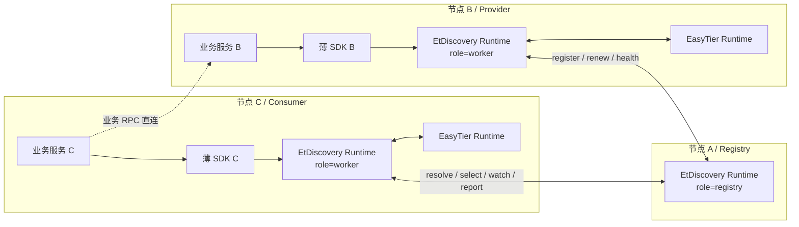
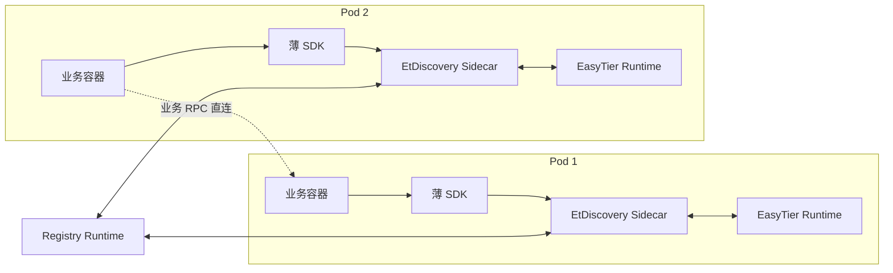
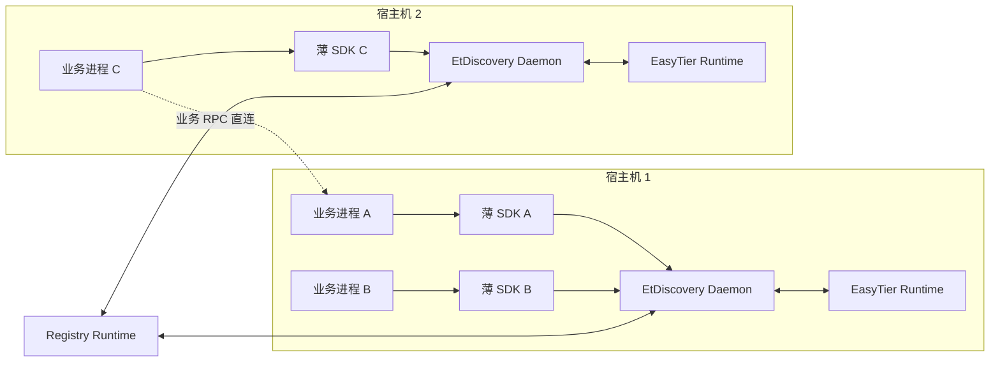
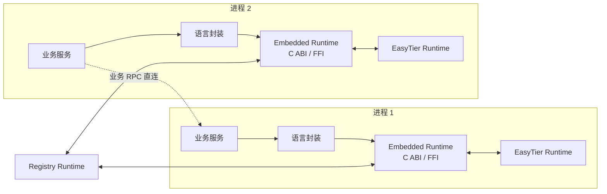

# 应用层与集成设计

本文档聚焦应用层 API、现有服务注册体系的集成与替代路径，以及移动端打包边界。

## 1. 应用层定位

应用层负责：

- 给业务提供统一的注册与发现接口
- 返回“可调用实例 + 推荐调用方式”
- 将业务调用反馈回写给调度层

应用层不负责：

- 代理业务 RPC
- 接管业务重试策略
- 伪装成现有注册中心协议兼容层

首版主推进方向建议进一步明确为：

- `registry` 与 `worker` 复用同一份 EtDiscovery runtime 代码。
- runtime 通过配置或启动参数决定当前节点角色，而不是和业务服务耦合成两套产品。
- 业务侧 SDK 首版保持很薄，主要负责调用本地 runtime 暴露的 HTTP/gRPC 接口。
- 业务服务获取目标实例后，继续使用自己现有的 HTTP/gRPC/TCP 客户端直连目标业务地址。

换句话说，首版更接近：

- EtDiscovery runtime 是一个独立本地组件
- 各语言 SDK 是这个本地组件的轻量 client wrapper
- 业务调用链仍是“先查地址，再直连发业务 RPC”

## 2. 首版代码组织与语言 SDK 边界

建议把首版代码组织冻结成以下形态：

- 一份统一 runtime 代码
  - 负责 `registry`、`worker` 等角色的公共能力
  - 通过角色分支决定当前节点启用哪些子模块
- 多个承载模式
  - sidecar
  - host daemon
  - embedded runtime
- 多语言薄 SDK
  - Node.js/Java/.NET 首版都优先做 runtime client
  - 不把服务选择、bootstrap、网络诊断状态机复制到各语言

### 2.1 runtime 内部建议分层

- control-plane client
  - 与 registry 通信
- discovery engine
  - 本地缓存、watch、实例选择、反馈回写
- EasyTier bridge
  - 读取 peer/route/link/network 信号
- diagnostics
  - 调试、健康、错误码、评分拆解
- role host
  - 根据 `registry` 或 `worker` 角色启用不同能力

### 2.2 业务 SDK 首版建议只承担的职责

- 组装注册、查询、选择、反馈请求
- 与本地 runtime 的 HTTP/gRPC client 通信
- 把返回值映射为语言友好的对象
- 对 `watch`、重连和少量本地缓存做轻量封装
- 为 Spring、Dubbo、.NET DI、Node.js 中间件提供薄适配

### 2.3 业务 SDK 首版不建议承担的职责

- 直接与远端 registry 通信
- 自己实现 registry bootstrap discovery
- 自己读取 EasyTier route/peer 元数据
- 在各语言里复制完整评分与选择逻辑
- 代理或接管业务 RPC 连接池、序列化、重试

### 2.4 最小调用闭环

以 `1 registry + 2 worker + 2 app` 的极简场景为例，首版推荐闭环是：

1. 一台设备或容器运行 `registry` 角色。
2. 两台靠近业务应用的设备或容器各运行一个 `worker` 角色。
3. provider 和 consumer 都通过各自语言的薄 SDK 调用本地 `worker`。
4. provider 侧 `worker` 负责注册、续约、健康上报。
5. consumer 侧 `worker` 负责查询、筛选、评分、返回 `SelectedInstance`。
6. consumer 应用拿到目标地址后，直接向目标实例的 `virtual_ip:port` 或 `recommended_endpoint` 发起业务 RPC。

## 3. 架构图

### 3.1 极简三节点主路径

### 3.2 Kubernetes Sidecar 模式

### 3.3 Host Daemon / Slim 模式

### 3.4 Embedded Runtime / C ABI 模式

## 4. SDK API 草案

本节中，已经进入当前原型的能力会额外标注“已落地”；仅保留接口占位的会标注“占位”。

### 4.1 注册 API

- `register_service(definition, instance, health_check)`
  - 已落地为 `POST /discovery/instances`
- `renew(instance_id, lease_epoch)`
  - 当前仅保留接口方向，对应 `PUT /discovery/instances/{instanceId}/lease` 占位
- `deregister(instance_id)`
  - 已落地为 `DELETE /discovery/instances/{instanceId}`
- `set_draining(instance_id)`
  - 当前仅保留接口方向，将由 `status` 类接口承载

### 4.2 发现 API

- `resolve(service_query) -> ordered instances`
  - 已落地为 `GET /discovery/services?serviceName=...`
- `selectOneHealthyInstance(service_query, call_context) -> selected instance`
  - 已落地为 `GET /discovery/select`
- `selectManyHealthyInstances(service_query, call_context, limit) -> ordered selected instances`
- `watch(service_query) -> instance change stream`
- `get_node_profile(node_id)`

### 4.3 调用治理 API

- `recommend_call_mode(selected_instance, call_context)`
- `report_call_result(selected_instance_id, result, latency, error_type)`
- `open_circuit(instance_id, reason)`

### 4.4 设计约束

- API 的最小核心是“注册、发现、选择、反馈”四件事。
- `selectOneHealthyInstance` 是首版最重要的应用层能力。
- `watch` 需要支持本地缓存回放和断线重连。
- `call_context` 需要包含调用方角色、区域、网络偏好、协议要求与超时预算。
- 当前原型已经把“注册、发现、选择”打通；“续租、watch、反馈、主动状态控制”仍待后续补齐。
- 当前原型的数据读取语义不是强一致读，而是“读取共享内存数据源的瞬时快照”：
  - 注册表和节点观测允许并发更新
  - 查询接口读取当前时刻可见视图
  - 连续两次查询可能得到不同结果，这被视为正常行为

## 5. SelectedInstance 返回模型建议

建议至少包含：

- `service_name`
- `instance_id`
- `node_id`
- `virtual_ip`
- `endpoints`
- `protocols`
- `recommended_endpoint`
- `recommended_call_mode`
- `health_state`
- `score`
- `score_breakdown`
- `node_profile`
- `link_profile`
- `topology_path`
- `config_epoch`
- `acl_epoch`
- `config_validity`

这样业务方可以：

- 继续使用现有 HTTP/gRPC/TCP 客户端
- 只把 etdiscovery 当成“智能地址簿 + 选择器”
- 在失败后把实际结果反馈回来

首版建议至少保证 `SelectedInstance` 能直接支撑“拿到即发起连接”的体验：

- 应用不应只拿到一个孤立的 `virtual_ip`
- 而应拿到可直接构造目标地址的 `recommended_endpoint`
- 同时保留 `virtual_ip`、`port`、`protocol` 作为显式诊断字段
- 如果后续接入 gRPC/Spring/Dubbo，也应围绕这个统一返回模型适配

## 6. 与现有服务注册框架的关系

### 6.1 不做协议兼容的原因

- 现有系统大多针对稳定局域网或数据中心拓扑设计。
- etdiscovery 的核心差异是把 NAT、relay、虚拟网络链路质量、跨区域分区和移动网络波动纳入选择逻辑。
- 如果一开始就做 Nacos/Consul/ZooKeeper 协议兼容，会被历史模型约束。

### 6.2 可以借鉴的接口风格

- 从 ZooKeeper 借鉴 watch 与临时节点语义
- 从 Nacos 借鉴服务/实例/元数据/心跳状态模型
- 从 Consul 借鉴 agent 模式、prepared query 和健康检查分类
- 从 gRPC 借鉴 name resolver 风格的地址解析边界
- 从 Spring Cloud LoadBalancer、Dubbo 借鉴调用方集成体验

### 6.3 替代与接入路径

替代路径：

- 新服务直接接入 etdiscovery SDK
- 调用方通过 `selectOneHealthyInstance` 获取目标地址
- 原业务协议栈保持不变

接入路径：

- 旧服务仍保留原服务治理体系
- 新增一个轻量适配层，把业务注册和查询逐步切到 etdiscovery
- 先替换“发现与选择”，后替换“注册与健康上报”

当前原型对应关系：

- 服务发布配置已切换为 `Services[]`
- worker 实例注册通过 HTTP 直接完成
- registry 当前维护内存实例注册表
- worker 定位 registry 的方式为：
  - 优先 `RegistryPeer`
  - 否则回退到首个远端可发现 peer 的 `VirtualIp`
- `/discovery/services` 与 `/discovery/select` 已可作为最小发现入口
- 运维和管理端状态控制接口目前仍为占位
- 读取接口的行为约定是：
  - 读取 registry 当前内存数据源的瞬时视图
  - 接受节点状态、实例状态存在少量滞后和短暂不一致

## 7. 典型框架集成方向

### 7.1 gRPC

- 可把 etdiscovery 作为 name resolver 或外部地址发现源
- gRPC channel 继续负责连接池、重试和负载均衡细节
- etdiscovery 负责提供更适合弱网环境的候选列表

### 7.2 Spring 生态

- 可作为 `ServiceInstanceListSupplier` 或等价上游数据源
- 保持 Spring Cloud LoadBalancer 的调用习惯
- 避免首版深度侵入 Spring 注册发现抽象

### 7.3 Dubbo

- 可先接在地址发现或路由规则之前
- 把 etdiscovery 输出当作候选 provider 列表
- 不直接复刻 Dubbo 注册中心 SPI

### 7.4 HTTP/TCP 自定义客户端

- 这类接入最直接
- 业务只需在发起连接前查询一次，或订阅 watch 做本地缓存

## 8. runtime 应用层协议建议

如果首版采用 sidecar/daemon 为主路径，建议应用层协议具备：

- 查询接口：同步获取候选实例
- watch 接口：流式接收实例变化
- 反馈接口：上报调用结果和异常类型
- 健康接口：注册本地健康检查结果
- 诊断接口：返回评分拆解、当前缓存和最近路由选择原因

建议至少保留两层协议：

- gRPC：主接口
- HTTP/JSON：调试和运维友好接口

当前原型现状：

- 目前只实现了 HTTP/JSON 形态
- 尚未引入 gRPC sidecar 协议
- 对业务迁移最有用的最小 HTTP 接口目前包括：
  - `POST /discovery/instances`
  - `DELETE /discovery/instances/{instanceId}`
  - `GET /discovery/instances/{instanceId}`
  - `GET /discovery/services`
  - `GET /discovery/select`

补充约束：

- SDK 默认请求本地 runtime，而不是远端 registry
- runtime 再决定是访问远端 registry、读取本地缓存，还是结合 EasyTier 网络信息作出选择
- sidecar、daemon、embedded 三种模式应共享同一套语义、错误码和返回模型

## 9. 移动端打包与应用边界

首版结论：

- 不正式落地移动端 SDK
- 但应用层模型必须提前给移动端留口子

需要预留的字段：

- `network_type`
- `battery`
- `foreground`
- `background_restricted`
- `mobile_tun`
- `roaming`

后续打包方向：

- App、SDK、EasyTier core 尽量作为单一安装单元分发
- EasyTier runtime 生命周期尽量由 SDK 接管
- 必要时由宿主应用提供 TUN FD 或系统能力桥接

移动端应用层约束：

- 默认作为 `C` 角色
- 不默认成为服务提供方
- 断网、切网、后台挂起都应被视为常态，而不是异常
