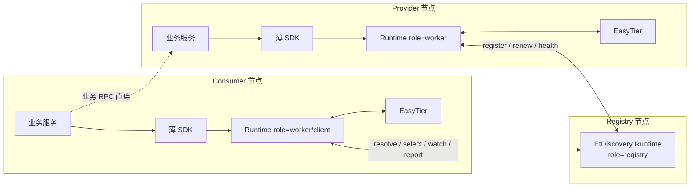
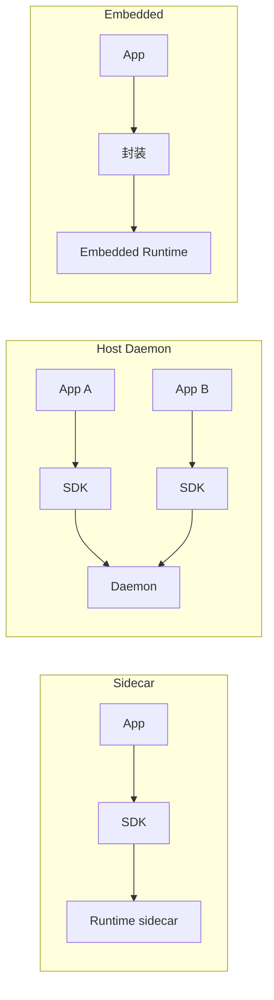

# 应用层与集成设计

本文档是 **应用层 API、运行模式与 SDK 边界、框架集成** 的权威说明。  
实现进度与占位接口清单见 [实施方案与阶段计划](./service-registry-plan.md#2-当前实现进度)。  
Registry 自动发现协议见 [Registry Bootstrap Discovery](./service-registry-bootstrap-discovery.md)。  
角色与评分模型见 [核心设计](./service-registry-core-design.md)。

---

## 1. 应用层定位

应用层负责：

- 给业务提供统一的注册与发现接口
- 返回“可调用实例 + 推荐调用方式”
- 将业务调用反馈回写给调度层

应用层不负责：

- 代理业务 RPC
- 接管业务重试策略
- 伪装成现有注册中心协议兼容层

定位一句话：

- EtDiscovery runtime 是独立本地组件
- 各语言 SDK 是 runtime 的轻量 client wrapper
- 业务调用链是“先查地址，再直连发业务 RPC”

---

## 2. 运行模式与 SDK 边界

将“部署形态”和“应用接入契约”解耦：同一套 API 语义，多种承载方式。

### 2.1 三层边界

| 边界 | 职责 |
| --- | --- |
| 应用进程 | 业务身份、服务定义、业务健康、调用反馈；保留 HTTP/gRPC/TCP 栈；不感知 EasyTier 路由细节，不跑 registry bootstrap |
| 本地 runtime | registry 定位、缓存、watch、实例选择、反馈汇总、诊断；与 EasyTier 控制桥；可选托管 EasyTier 进程 |
| registry / control-plane | 目录聚合、状态整合、策略下发、审计与跨节点视图；不接管业务连接池与序列化 |

约束：

- SDK：稳定契约（注册、发现、选择、反馈）
- runtime：网络与缓存复杂度
- 业务框架：真正发请求

### 2.2 中间件定位

EtDiscovery 介于 APM 与 service mesh 之间：

- 比 mesh 更贴近应用（身份、健康、元数据、反馈来自应用语义）
- 比 APM 更松耦合（不强制侵入每个调用栈）
- K8s 中 sidecar / Node daemon / 宿主机进程只是承载位置不同，契约不变

不宜做成“强绑定某框架的深嵌 SDK”，也不宜退化成“完全无应用参与的透明代理”。推荐：**薄 SDK + 本地 runtime**。

### 2.3 运行模式矩阵

`Mode` 为 runtime **启动必传**（`--mode` / `ETDISCOVERY_MODE` / `EtDiscovery:Mode`）。  
取值：`sidecar` | `daemon` | `embedded`（旧名 `standalone` → `embedded`）。  
矩阵、配置拆分、SDK 契约见 [应用 ↔ Runtime 交互](./service-registry-app-runtime-interaction.md)。

| mode | 说明 | EasyTier | 典型 |
| --- | --- | --- | --- |
| `sidecar` | 业务旁路；SDK 连本机 runtime | 捆绑托管 | K8s 一 Pod 一服务（`worker,client`） |
| `daemon` | 同 NS 多业务共享 EtDiscovery | 不捆绑；隧道外置 | VM 多进程互调 |
| `embedded` | 进程一体（内嵌或本进程即 EtDiscovery） | 捆绑托管 | K8s registry |
| no-SDK | 直接打本地 `/runtime/v1` | — | 运维验证 |

业务配置瘦身（无 NetworkSecret / EasyTier / Mode / Roles）；运维配置挂 runtime（daemon 下 EasyTier 另单元）。

### 2.4 代码组织

- 一份统一 runtime：`registry` / `worker` / `client` 等为角色分支，不是多套产品
- 多语言薄 SDK：首版优先 runtime client，不在各语言复制选择/bootstrap/评分状态机

runtime 内部建议分层：

- control-plane client
- discovery engine（缓存、watch、选择、反馈）
- EasyTier bridge
- diagnostics
- role host

业务 SDK 建议只做：请求组装、本地 runtime 通信、对象映射、轻量 watch/缓存、框架薄适配。  
业务 SDK 不做：直连远端 registry、bootstrap、读 EasyTier route、完整评分、代理业务 RPC。

### 2.5 最小调用闭环

1. 一节点 `registry`。
2. 靠近业务的节点各跑 `worker`（和/或 `client`）。
3. provider / consumer 经薄 SDK 调本地 runtime。
4. provider 侧注册、续约、健康上报。
5. consumer 侧查询、筛选、返回 `SelectedInstance`。
6. 应用直连目标 `virtual_ip:port` 或 `recommended_endpoint`。

### 2.6 协议层建议

- 应用可见：`register / renew / deregister / resolve / select / watch / report`
- runtime 内部：bootstrap、cache、policy、diagnostics、EasyTier bridge
- 传输：长期 gRPC 为主、HTTP/JSON 便于调试与无 SDK 接入；当前原型以 HTTP/JSON 为主

---

## 3. 架构图

### 3.1 极简主路径

### 3.2 Sidecar / Daemon / Embedded

三种承载只改变 runtime 与业务进程的部署关系，不改变上图语义。示意见下：

---

## 4. 应用层 API

本节定义语义 API 与当前 HTTP 映射。**是否已实现只在 [plan](./service-registry-plan.md#22-接口进度清单) 维护，此处不写进度勾选。**

### 4.1 设计约定

- 以 **实例资源** 为核心；服务名是筛选维度，不是唯一控制入口
- 注册与下线分离；续租、健康、运维状态、元数据宜独立子资源
- 最小核心能力：注册、发现、选择、反馈
- `selectOneHealthyInstance` 是首版最重要的消费侧能力
- 读取语义：共享状态的瞬时快照，非强一致事务读（见核心设计与 plan）

### 4.2 API 对照表

| 能力 | 语义 API | HTTP（原型约定） | 说明 |
| --- | --- | --- | --- |
| 注册/更新实例 | `register_service` | `POST /discovery/instances` | upsert by instanceId |
| 注销实例 | `deregister` | `DELETE /discovery/instances/{instanceId}` | |
| 查询单实例 | — | `GET /discovery/instances/{instanceId}` | |
| 按服务列实例 | `resolve` | `GET /discovery/services?serviceName=...` | |
| 选择实例 | `selectOneHealthyInstance` | `GET /discovery/select` | |
| 选择多个 | `selectManyHealthyInstances` | 待补充 | |
| 续租 | `renew` | `PUT /discovery/instances/{instanceId}/lease` | |
| 健康上报 | — | `PUT /discovery/instances/{instanceId}/health` | |
| 运维状态 | `set_draining` 等 | `PUT/DELETE .../status` | 含 node 级 status |
| 元数据更新 | — | `PUT /discovery/instances/{instanceId}/metadata` | |
| 实例列表 | — | `GET /discovery/instances` | |
| 节点下实例 | — | `GET /discovery/nodes/{nodeId}/instances` | |
| Watch | `watch` | 待定（流式） | 需本地缓存回放与重连 |
| 调用反馈 | `report_call_result` | 待定 | |
| 推荐调用方式 | `recommend_call_mode` | 待定 | |
| Registry 元数据 | （bootstrap） | `GET /discovery/registry` | 见 bootstrap 文档；**不是** `/.well-known/...` |
| 进程健康 | — | `GET /health` | 运维 |
| Peer 观测 | — | `GET /easytier/peers` | 运维/诊断 |

### 4.3 注册 API（语义）

- `register_service(definition, instance, health_check)`
- `renew(instance_id, lease_epoch)`
- `deregister(instance_id)`
- `set_draining(instance_id)`（由 status 类接口承载）

### 4.4 发现 API（语义）

- `resolve(service_query) -> ordered instances`
- `selectOneHealthyInstance(service_query, call_context) -> selected instance`
- `selectManyHealthyInstances(service_query, call_context, limit)`
- `watch(service_query) -> instance change stream`
- `get_node_profile(node_id)`

`call_context` 宜包含：调用方角色、区域、网络偏好、协议要求、超时预算。

### 4.5 调用治理 API（语义）

- `recommend_call_mode(selected_instance, call_context)`
- `report_call_result(selected_instance_id, result, latency, error_type)`
- `open_circuit(instance_id, reason)`

### 4.6 与 registry 定位的关系

worker/client 如何找到 registry 属于 bootstrap 协议，**不**在各语言 SDK 内实现。  
候选优先级见 [bootstrap](./service-registry-bootstrap-discovery.md)：

1. 显式 `RegistryCandidates`
2. EasyTier route metadata（`node_type_app_id` + registry bit）
3. 探测 `GET /discovery/registry`

配置字段使用 `RegistryCandidates`；旧名 `RegistryPeer` 仅过渡期兼容，计划移除。

---

## 5. SelectedInstance 返回模型

建议至少包含：

- `service_name`、`instance_id`、`node_id`
- `virtual_ip`、`endpoints`、`protocols`
- `recommended_endpoint`、`recommended_call_mode`
- `health_state`、`score`、`score_breakdown`
- `node_profile`、`link_profile`、`topology_path`
- `config_epoch`、`acl_epoch`、`config_validity`

首版体验：应用应能“拿到即连接”——以 `recommended_endpoint` 为主，保留 `virtual_ip` / `port` / `protocol` 作诊断。

---

## 6. 与现有服务注册框架的关系

### 6.1 不做协议兼容的原因

- 既有系统多假设稳定数据中心网络
- EtDiscovery 要把 NAT、relay、链路质量、跨区域与移动波动纳入选择
- 一上来做 Nacos/Consul 协议兼容会被历史模型绑死

### 6.2 可借鉴的风格（细节见 references）

- ZooKeeper：watch、临时节点语义
- Nacos：服务/实例/元数据/心跳
- Consul：agent、maintenance、健康分类
- gRPC name resolver：发现与调用解耦
- Spring Cloud LoadBalancer / Dubbo：消费侧集成体验

第三方摘要见 [参考资料](./service-registry-references.md)。

### 6.3 替代与接入路径

- **替代**：新服务直连 EtDiscovery SDK → `selectOneHealthyInstance` → 原 RPC 栈直连
- **渐进**：旧治理保留；先替换发现与选择，再替换注册与健康上报

---

## 7. 典型框架集成方向

### 7.1 gRPC

- 作 name resolver 或外部地址源；channel 仍管连接池/重试

### 7.2 Spring

- `ServiceInstanceListSupplier` 或等价上游；避免首版深度侵入注册抽象

### 7.3 Dubbo

- 接在地址发现/路由前，输出作候选 provider 列表

### 7.4 HTTP/TCP 自定义客户端

- 发起连接前查询一次，或 watch + 本地缓存

---

## 8. 移动端边界

首版不正式落地移动端 SDK，但模型预留：

- `network_type`、`battery`、`foreground`、`background_restricted`、`mobile_tun`、`roaming`

约束倾向：

- 默认偏 `client`，不默认作服务提供方
- 断网、切网、后台挂起视为常态
- 后续分发倾向 App + SDK + EasyTier 一体；生命周期由 SDK 或宿主桥接 TUN FD
