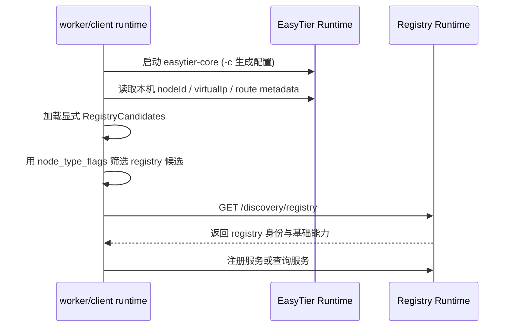

# Registry Bootstrap Discovery

本文档描述 worker/client 在加入 EasyTier 网络后 **如何自动定位 registry** 的目标设计。  
实现进度与联调回归见 [plan](./service-registry-plan.md)；硬约定见 [AGENTS.md](../AGENTS.md)；启动排查见 [runbook](./service-registry-prototype-validation.md)。  
完整应用层 API 表见 [应用层与集成](./service-registry-application-layer.md#4-应用层-api)。

---

## 1. 背景与问题

最小原型已证明：registry 可托管 EasyTier 并维护实例目录；worker 可经 HTTP 注册绑定自身虚拟 IP 的实例。

但必须区分：

- `EasyTier.Peers`：入网 bootstrap seed，**不等于** EtDiscovery registry
- EasyTier 网络中可能存在 relay、打洞辅助、无 VIP 节点、纯 client 等

因此需要内置 registry bootstrap：节点入网后自动知道“registry 在哪、注册/查询入口是什么”。

---

## 2. 设计目标

- worker 入网后自动找到 registry 并注册本机服务实例
- client 入网后自动找到 registry 并查询服务
- 服务实例仍绑定真实虚拟 IP
- relay / 打洞 / 无 VIP peer 默认可观测，但不自动成为 registry
- 显式配置与 route metadata 发现可共存
- EasyTier 核心保持通用，不硬编码 EtDiscovery 业务模型
- bootstrap 逻辑在 EtDiscovery runtime；业务 SDK 不直接扫 peer

非目标：

- 不替代 EasyTier 的虚拟 IP 分配、路由、打洞和 relay
- 不在本阶段实现 registry 强一致选主
- 不要求业务应用直接参与 bootstrap 协议

---

## 3. 核心原则

### 3.1 EasyTier peer 不等于 registry

只有明确声明 registry 能力、并通过探测校验的节点，才可作为 EtDiscovery registry。

### 3.1.1 节点类型标记优先于 HTTP 扫描

优先使用 EasyTier `node_type_flags` / `node_type_app_id` 定位候选，而不是对所有 peer VIP 做 HTTP 扫描。

| 字段 / 位 | 含义 |
| --- | --- |
| `node_type_app_id = 1` | EtDiscovery |
| bit 16 | registry |
| bit 17 | worker |
| bit 18 | client |

规则：

- 标志位**只由本地 `--roles` 推导并写入** EasyTier 配置，应用不能覆盖
- 远端若 `app_id != 1` 或高 16 位全 0，则视为 `worker`
- 找到候选后访问 `GET /discovery/registry` 做轻量校验，不能只凭 bit 完全信任
- 端口、region、priority、协议版本等走 HTTP API，不塞进 bitset

### 3.2 服务实例必须绑定虚拟 IP

实例至少绑定 `serviceName` / `instanceId` / `nodeId` / `virtualIp` / `port` / `protocol`。

### 3.3 registry 是控制面入口，不是网络网关

业务调用仍优先经 EasyTier 虚拟 IP 直连服务实例。

### 3.4 自动发现必须可解释

找不到 registry 时应能说明原因，例如：

- 未加入 EasyTier 网络
- 本机没有虚拟 IP
- 无显式候选且 route metadata 中无 registry 位
- registry 元数据探测失败 / network 不匹配

---

## 4. 协议概览



候选来源优先级：

1. 显式 `RegistryCandidates`
2. EasyTier route metadata：`app_id=1` 且带 registry bit，且同网/在 CIDR 内、有 VIP
3. **不做**“首个 peer VIP” fallback

---

## 5. 配置模型

#### Registry 示例

```json
{
  "EtDiscovery": {
    "NetworkName": "prod",
    "NetworkSecret": "secret",
    "VirtualNetworkCidr": "10.1.0.0/16",
    "ListenUrl": "http://0.0.0.0:8080",
    "DiscoveryPort": 8080,
    "Services": []
  },
  "EasyTier": {
    "CorePath": "easytier-core",
    "InstanceName": "registry-a",
    "Ipv4": "10.1.1.1",
    "Peers": [],
    "Listeners": []
  }
}
```

#### Worker 示例

```json
{
  "EtDiscovery": {
    "NetworkName": "prod",
    "NetworkSecret": "secret",
    "VirtualNetworkCidr": "10.1.0.0/16",
    "ListenUrl": "http://127.0.0.1:8081",
    "RegistryCandidates": [],
    "DiscoveryPort": 8080,
    "AutoDiscoverFromRouteMetadata": true,
    "Services": [
      {
        "ServiceName": "test",
        "Port": 8081,
        "Protocol": "http"
      }
    ]
  },
  "EasyTier": {
    "CorePath": "easytier-core",
    "InstanceName": "worker-a",
    "Ipv4": "",
    "Dhcp": true,
    "Peers": [
      "tcp://registry-public-host:11010"
    ],
    "Listeners": []
  }
}
```

说明：

- `EasyTier.Peers`：只用于加入 EasyTier 网络，**不是** registry 列表
- `EtDiscovery.RegistryCandidates`：显式 registry 地址/VIP；可为空，走 route metadata
- `EtDiscovery.DiscoveryPort`：route metadata 候选无绝对 URL 时拼 `http://{vip}:{port}`
- `EtDiscovery.AutoDiscoverFromRouteMetadata`：是否允许从 route metadata 发现 registry
- **registry 的 `ListenUrl` 必须对虚拟网可达**（推荐 `0.0.0.0`）；worker 可只绑本机
- **不提供** `NodeTypeFlags` / `NodeTypeAppId` 配置项；始终由角色推导
- `EasyTier.Listeners` 为空时，生成器写入默认 11010 系监听
- 启动命令要求 `--roles`；其余优先从配置文件读取

配置迁移：旧字段 `RegistryPeer` 若仍可读，仅为过渡；**计划移除**，新配置只使用 `RegistryCandidates`。

### 5.1 EasyTier 启动方式

EtDiscovery runtime 生成临时 TOML（含 `node_type_*`、network identity、peers、listeners 等），然后：

```bash
easytier-core -c <generated.toml> --rpc-portal <allocated>
```

注意：只传 `-c` + `--rpc-portal` 时，EasyTier CLI **不会**再 merge 默认 network 选项；listeners / node_type / peers 等必须出现在生成的 TOML 中。

---

## 6. Registry 元数据接口

```http
GET /discovery/registry
```

- 与其它 `/discovery/*` 并列
- 仅 registry 角色返回 200；其他角色 403
- 不使用 `/.well-known/etdiscovery`

响应示例：

```json
{
  "protocol": "etdiscovery",
  "protocolVersion": "0.1",
  "networkName": "prod",
  "nodeId": "peer:123",
  "virtualIp": "10.1.1.1",
  "roles": ["registry"],
  "endpoints": {
    "http": "http://10.1.1.1:8080"
  },
  "capabilities": {
    "serviceRegistration": true,
    "serviceResolve": true
  }
}
```

首版校验：

- `networkName` 匹配本地配置
- `roles` 包含 `registry`
- HTTP 可达

---

## 7. 节点启动流程

### 7.1 worker

1. 启动 EasyTier runtime（生成配置 + `-c`）
2. 等待本机 `nodeId` / `virtualIp`
3. 读取 EasyTier peer/route metadata
4. 显式候选 + registry 角色位构建候选列表
5. 对 route metadata 候选探测 `/discovery/registry`
6. 注册 `Services[]`
7. 周期性续约（后续阶段）

无虚拟 IP 时不注册服务。

### 7.2 client

与 worker 相同的 registry 发现路径；不要求发布 `Services[]`。

### 7.3 registry

1. 启动 EasyTier runtime
2. 由角色自动写入 `node_type_app_id=1` 与 registry bit
3. 暴露 `/discovery/registry` 与注册/查询接口
4. 虚拟 IP 尽量固定

---

## 8. 选择策略

1. 本地角色包含 registry → 使用本机 `ListenUrl`
2. 显式 `RegistryCandidates` 优先，默认信任配置
3. route metadata 候选按观测顺序尝试，需通过 `/discovery/registry` 校验
4. 全部失败 → `registry_candidate_missing`（或等价 blocking reason）

---

## 9. 本地缓存模型

后续阶段落地 `LastKnownRegistries`；设计上允许断连后短期使用上次成功的 registry 入口。

---

## 10. 与服务实例注册的关系

bootstrap 只解决“去哪注册/查询”，不改变实例绑定 worker 虚拟 IP 的模型。  
实例 CRUD 见 [应用层 API](./service-registry-application-layer.md#4-应用层-api)。

---

## 11. 与 relay / 打洞节点的关系

- 无 VIP：不能承载服务实例，也不能作为 VIP 型 registry 候选
- 无 EtDiscovery app_id / registry bit：默认不作为 registry 候选
- 有 registry 位：可作为候选，仍建议 `/discovery/registry` 校验

---

## 12. 可观测性

- `GET /health`：advertised node type、selected registry 等
- `GET /easytier/peers`：roles / `node_type_*` / isRegistryCandidate
- `GET /discovery/registry`：registry 身份声明

后续可补：`GET /bootstrap/status`、`POST /bootstrap/refresh`。

---

## 13. 安全边界

- 标志位不可由配置覆盖，降低“自封 registry”的配置面误用
- 元数据是能力提示，不是认证结果
- 首版至少校验 `networkName`
- 后续再增强签名、credential 绑定、白名单

---

## 14. 分阶段落地（设计路线）

进度勾选以 [plan](./service-registry-plan.md#23-bootstrap-相关进度) 为准。

| 阶段 | 内容 |
| --- | --- |
| A | 配置拆分、TOML `-c`、角色 → node_type、route metadata 检测、`GET /discovery/registry`、去掉首个 VIP 当 registry |
| B | last-known cache、`/bootstrap/status`、探测超时/失败原因聚合 |
| C | 可选旧节点扫描 fallback、声明签名、多 registry 协同 |

---

## 15. 与独立 runtime 的关系

- Core：角色 bit 约定、纯逻辑
- Web/host：EasyTier bridge、HTTP API、role host
- 业务 SDK：只调本地 runtime，不直接读 EasyTier route

手工验证命令与清单见 [原型验证 runbook](./service-registry-prototype-validation.md)。
