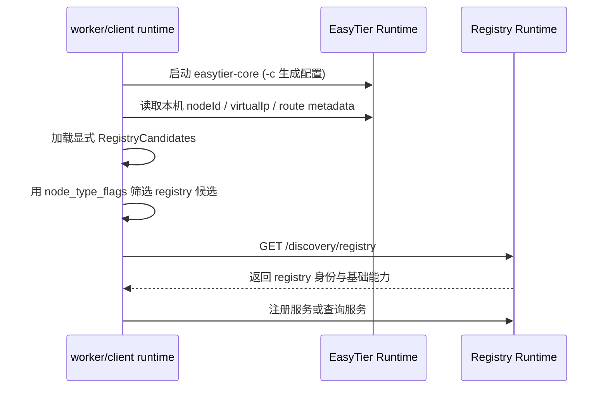

# Registry Bootstrap Discovery 设计草案

本文档讨论 EtDiscovery 中类似 DHCP 的 registry 自动发现机制。目标是在 worker/client 节点加入 EasyTier 网络后，即使业务层不知道 registry 的虚拟 IP，也能自动找到可用 registry，并完成服务注册或服务查询。

## 当前实现状态（2026-07-11）

### EasyTier 最小支撑

- `RoutePeerInfo` 已新增 `node_type_flags = 25`
- `RoutePeerInfo` 已新增 `optional node_type_app_id = 27`
- 字段链路：外部配置注入 → 本节点 route info → OSPF/route sync → 远端 route 查询
- EasyTier 核心只做透明传输，不解释 EtDiscovery 业务语义，也不自动填充
- 手工观测可用：`easytier-cli -o json node info` / `peer list -v` / `route list`

### EtDiscovery 本阶段已落地（并完成联调）

- 配置拆分：`EtDiscovery` 与 `EasyTier` 分离
  - `Peers` **只**属于 `EasyTier` 节，不再放入 `EtDiscovery`
  - `NetworkName` / `NetworkSecret` 暂时仍保留在 `EtDiscovery`（后续可再迁移）
  - **不提供** `NodeTypeFlags` / `NodeTypeAppId` 配置项
- `easytier-core` 启动改为生成 TOML，并通过 `-c` 传入；仅保留运行时必要的 `--rpc-portal`
- 本机角色通过 EasyTier 元数据广播：
  - `node_type_app_id = 1`（EtDiscovery）
  - high bits：registry=`1<<16` / worker=`1<<17` / client=`1<<18`
  - **禁止**应用配置覆盖这些标志位，始终由 `--roles` 推导
- registry 检测：
  1. 显式 `RegistryCandidates`（兼容 `RegistryPeer`）
  2. route metadata 中带 registry 角色位的 peer（`peer list -v` 读取 `node_type_*`）
  3. route metadata 候选会探测 `GET /discovery/registry`
  4. **不再**把“首个可发现 peer VIP”当作 registry
- 无相关元数据字段的远端 peer，默认视为 `worker`
- 简化 registry 元数据接口：`GET /discovery/registry`（与 `/discovery/*` 并列，不使用 `.well-known`）
- 主要代码入口：
  - `EtDiscovery.Core/Models/EtDiscoveryNodeTypeFlags.cs`
  - `EtDiscovery.Web/Services/EasyTierConfigGenerator.cs`
  - `EtDiscovery.Web/Services/RegistryLocator.cs`
  - `EtDiscovery.Web/Services/PeerObservationMapper.cs`
  - `EtDiscovery.Web/Services/WorkerRegistrationOrchestrator.cs`

### 联调中确认并修掉的问题

| 现象 | 根因 | 处理 |
|------|------|------|
| worker 拿不到虚拟 IP，peer 连 registry 超时 | 仅 `-c` 启动且 TOML 无 `listeners` 时，CLI 不会再补默认 11010；registry 只剩 `ring://` | 生成配置在 `Listeners` 为空时写入 EasyTier 默认 listeners |
| `routeMetadataCandidates=0`，verbose peer routes 解析失败 | `peer list -v` 中 `ipv4_addr.address` 是 `{addr:u32}` 对象，不是 string | route DTO 只保留 `peer_id` / `hostname` / `node_type_*`，忽略嵌套地址 |
| 访问 `http://10.x.x.x:8080` 连接超时 | registry `ListenUrl=http://127.0.0.1:8080` 只绑回环，虚拟 IP 不可达 | registry 必须用 `http://0.0.0.0:8080`；启动时校验禁止 loopback |

### 运维约束（务必遵守）

1. **registry 的 `EtDiscovery:ListenUrl` 不能只绑 loopback**  
   - 正确：`http://0.0.0.0:8080`  
   - 错误：`http://127.0.0.1:8080`  
   - 原因：worker 通过 EasyTier 虚拟 IP + `DiscoveryPort` 访问 registry HTTP，不是访问 registry 的 127.0.0.1。
2. **生成的 EasyTier TOML 必须有 listeners**  
   - 未配置时自动写默认 `tcp/udp/ws/wss/wg`（11010 系）。  
   - 否则公网/远端 peer 无法 `tcp://registry:11010` 入网，DHCP 也不会分配 VIP。
3. **角色元数据不可手写**  
   - 只由 `--roles` 推导写入 `node_type_app_id` / `node_type_flags`。
4. **Windows 提权**  
   - 需要 VIP/DHCP 时用 `EtDiscovery.Web.exe`（manifest）启动；`dotnet xxx.dll` 不会 UAC。
5. **实例名**  
   - registry / worker 建议使用不同 `EasyTier:InstanceName`，避免同机 CLI `-n` 混淆。

### 本阶段暂未实现

- last-known registry 本地缓存
- 复杂评分 / region / locality
- 全量 peer HTTP 扫描 fallback
- 声明签名与强安全校验
- 多 registry 协同

## 1. 背景与问题

已有最小 Web 原型验证了：

- registry 可以托管 `easytier-core` 并读取真实 peer 状态。
- worker 可以通过 HTTP 向 registry 注册挂在自身虚拟 IP 上的服务实例。
- `registry + worker` 同机时可以直接走进程内注册。

但旧原型有一个明显问题：

- `peers` 是 EasyTier 的入网 bootstrap seed，不等于 EtDiscovery registry。
- 把首个远端可发现 peer 的虚拟 IP 当作 registry 只适合极小原型。
- EasyTier 网络里可能存在 relay、打洞辅助、无虚拟 IP 节点、纯 client 节点。

因此需要内置 registry bootstrap：节点加入虚拟网络后，自动知道“registry 在哪、注册/查询入口是什么”。

## 2. 设计目标

- worker 入网后自动找到 registry 并注册本机服务实例。
- client 入网后自动找到 registry 并查询服务。
- 服务实例仍绑定真实虚拟 IP。
- relay / 打洞 / 无 VIP peer 默认可观测，但不自动成为 registry。
- 显式配置与 route metadata 发现可共存。
- EasyTier 核心保持通用，不硬编码 EtDiscovery 业务模型。
- EtDiscovery 作为独立 runtime 持有 bootstrap 逻辑；业务 SDK 不直接扫 peer。

非目标：

- 不替代 EasyTier 的虚拟 IP 分配、路由、打洞和 relay。
- 不在本阶段实现 registry 强一致选主。
- 不要求业务应用直接参与 bootstrap 协议。

## 3. 核心原则

### 3.1 EasyTier peer 不等于 registry

只有明确声明 registry 能力，并通过探测校验的节点，才可作为 EtDiscovery registry。

### 3.1.1 节点类型标记优先于 HTTP 扫描

EtDiscovery 优先使用 EasyTier `node_type_flags` / `node_type_app_id` 定位候选，而不是对所有 peer 虚拟 IP 做 HTTP 扫描。

```text
node_type_app_id = 1: EtDiscovery
bit 16: registry
bit 17: worker
bit 18: client
```

规则：

- 标志位**只由本地 `--roles` 推导并写入** EasyTier 配置，应用不能覆盖。
- 远端若 `app_id != 1` 或高 16 位全 0，则视为 `worker`。
- 找到 registry 候选后，可访问 `GET /discovery/registry` 做轻量校验，不能只凭 bit 完全信任。
- 端口、region、priority、协议版本等结构化信息仍走 HTTP API，不塞进 bitset。

### 3.2 服务实例必须绑定虚拟 IP

实例至少绑定 `serviceName` / `instanceId` / `nodeId` / `virtualIp` / `port` / `protocol`。

### 3.3 registry 是控制面入口，不是网络网关

业务调用仍优先使用 EasyTier 虚拟 IP 直连服务实例。

### 3.4 自动发现必须可解释

找不到 registry 时，应能说明原因，例如：

- 未加入 EasyTier 网络
- 本机没有虚拟 IP
- 无显式候选且 route metadata 中无 registry 位
- registry 元数据探测失败 / network 不匹配

## 4. 协议概览



候选来源优先级：

1. 显式 `RegistryCandidates`（含兼容字段 `RegistryPeer`）
2. EasyTier route metadata：`app_id=1` 且带 registry bit，且同网/在 CIDR 内、有 VIP
3. 本阶段不做“首个 peer VIP” fallback

## 5. 配置模型

#### Registry 示例

```json
{
  "EtDiscovery": {
    "NetworkName": "prod",
    "NetworkSecret": "secret",
    "VirtualNetworkCidr": "10.1.0.0/16",
    "ListenUrl": "http://0.0.0.0:8080",
    "DiscoveryPort": 8080,
    "Services": []
  },
  "EasyTier": {
    "CorePath": "easytier-core",
    "InstanceName": "registry-a",
    "Ipv4": "10.1.1.1",
    "Peers": [],
    "Listeners": []
  }
}
```

#### Worker 示例

```json
{
  "EtDiscovery": {
    "NetworkName": "prod",
    "NetworkSecret": "secret",
    "VirtualNetworkCidr": "10.1.0.0/16",
    "ListenUrl": "http://127.0.0.1:8081",
    "RegistryCandidates": [],
    "DiscoveryPort": 8080,
    "AutoDiscoverFromRouteMetadata": true,
    "Services": [
      {
        "ServiceName": "test",
        "Port": 8081,
        "Protocol": "http"
      }
    ]
  },
  "EasyTier": {
    "CorePath": "easytier-core",
    "InstanceName": "worker-a",
    "Ipv4": "",
    "Dhcp": true,
    "Peers": [
      "tcp://registry-public-host:11010"
    ],
    "Listeners": []
  }
}
```

说明：

- `EasyTier.Peers`：只用于加入 EasyTier 网络，**不是** registry 列表。
- `EtDiscovery.RegistryCandidates`：显式 registry 地址/VIP；可为空，走 route metadata。
- `EtDiscovery.DiscoveryPort`：route metadata 候选没有绝对 URL 时使用（拼 `http://{vip}:{port}`）。
- `EtDiscovery.AutoDiscoverFromRouteMetadata`：是否允许从 route metadata 发现 registry。
- **registry 的 `ListenUrl` 必须对虚拟网可达**（推荐 `0.0.0.0`）；worker 可只绑本机。
- **不提供** `NodeTypeFlags` / `NodeTypeAppId` 配置项；始终由角色推导。
- `EasyTier.Listeners` 为空时，生成器写入默认 11010 系监听，避免公网 peer 连不上。
- 启动命令仍要求 `--roles`；其余优先从配置文件读取。

### 5.1 EasyTier 启动方式

EtDiscovery runtime 生成临时 TOML（包含 `node_type_*`、network identity、peers、listeners 等），然后：

```text
easytier-core -c <generated.toml> --rpc-portal <allocated>
```

注意：

- 只传 `-c` + `--rpc-portal` 时，EasyTier CLI **不会**再 merge 默认 network 选项。
- 因此 listeners / node_type / peers 等都必须出现在生成的 TOML 里，不能依赖旧 CLI 拼参路径的默认行为。
- 临时配置路径大致为：`%TEMP%/etdiscovery/<instance_name>/easytier.toml`。

## 6. Registry 元数据接口

本阶段使用普通 API，不使用 `.well-known`：

```http
GET /discovery/registry
```

仅 registry 角色返回 200；其他角色 403。

响应示例：

```json
{
  "protocol": "etdiscovery",
  "protocolVersion": "0.1",
  "networkName": "prod",
  "nodeId": "peer:123",
  "virtualIp": "10.1.1.1",
  "roles": ["registry"],
  "endpoints": {
    "http": "http://10.1.1.1:8080"
  },
  "capabilities": {
    "serviceRegistration": true,
    "serviceResolve": true
  }
}
```

首版校验：

- `networkName` 匹配本地配置
- `roles` 包含 `registry`
- HTTP 可达

## 7. 节点启动流程

### 7.1 worker

1. 启动 EasyTier runtime（生成配置 + `-c`）。
2. 等待本机 `nodeId` / `virtualIp`。
3. 读取 EasyTier peer/route metadata。
4. 显式候选 + registry 角色位构建候选列表。
5. 对 route metadata 候选探测 `/discovery/registry`。
6. 注册 `Services[]`。
7. 周期性续约（后续）。

无虚拟 IP 时不注册服务。

### 7.2 client

与 worker 相同的 registry 发现路径；不要求发布 `Services[]`。

### 7.3 registry

1. 启动 EasyTier runtime。
2. 由角色自动写入 `node_type_app_id=1` 与 registry bit。
3. 暴露 `/discovery/registry` 与注册/查询接口。
4. 虚拟 IP 尽量固定。

## 8. 选择策略（本阶段）

1. 本地角色包含 registry → 使用本机 `ListenUrl`。
2. 显式候选优先，默认直接信任配置。
3. route metadata 候选按观测顺序尝试，需通过 `/discovery/registry` 轻量校验。
4. 全部失败 → `registry_candidate_missing`。

## 9. 本地缓存模型

后续阶段再落地 `LastKnownRegistries`。本阶段不写缓存文件。

## 10. 与服务实例注册的关系

registry bootstrap 解决“去哪注册/查询”，不改变实例仍绑定 worker 虚拟 IP 的模型。

## 11. 与 relay / 打洞节点的关系

- 无 VIP：不能承载服务实例，也不能作为 VIP 型 registry 候选。
- 无 EtDiscovery app_id / registry bit：默认不作为 registry 候选，按 worker 观测。
- 有 registry 位：可作为候选，但仍建议做 `/discovery/registry` 校验。

## 12. 可观测性接口

已提供 / 扩展：

- `GET /health`：包含 advertised node type、selected registry
- `GET /easytier/peers`：包含 roles / node_type_* / isRegistryCandidate
- `GET /discovery/registry`：registry 身份声明

后续可再补：

- `GET /bootstrap/status`
- `POST /bootstrap/refresh`

## 13. 安全边界

- 标志位不可由配置覆盖，降低“自封 registry”的配置面误用。
- 元数据仍是能力提示，不是认证结果。
- 首版至少校验 `networkName`。
- 后续再增强签名、credential 绑定、白名单。

## 14. 分阶段落地路线

### 阶段 A（当前）

- 配置拆分 + 生成 TOML `-c`
- 角色 → node_type 广播（不可覆盖）
- route metadata registry 检测
- `GET /discovery/registry`
- 去掉 peers[0]/首个 VIP 当 registry

### 阶段 B

- last-known cache
- `/bootstrap/status`
- 更完整的探测超时/并发与失败原因聚合

### 阶段 C

- 可选 peer 扫描 fallback（仅兼容旧节点）
- 声明签名与更强身份校验
- 多 registry 协同

## 15. 与独立 runtime 的关系

实现上保持应用层文档中的分层：

- Core：角色 bit 约定、纯逻辑
- Web/host：EasyTier bridge、HTTP API、role host
- 业务 SDK：只调本地 runtime，不直接读 EasyTier route

本阶段未做完整 `DiscoveryRuntime` 接管，但 `RegistryLocator` / `EasyTierConfigGenerator` / 角色常量已按可注入服务边界拆分，便于后续收敛到独立 runtime。

## 手工验证参考

```powershell
# registry / worker（推荐发布目录下 start.bat + --roles）
.\EtDiscovery.Web.exe --roles registry
.\EtDiscovery.Web.exe --roles worker

# 观察 EasyTier 元数据（rpc portal / instance 见启动日志）
.\easytier-cli.exe -p <rpc> -n <instance> -o json node info
.\easytier-cli.exe -p <rpc> -n <instance> -o json -v peer list

# 验证 registry HTTP 对虚拟 IP 可达
curl http://10.1.1.1:8080/health
curl http://10.1.1.1:8080/discovery/registry
```

验证重点：

- 生成的 TOML 中含 `listeners`、`node_type_app_id` / `node_type_flags`，且与角色一致
- registry `node info.listeners` 含 `tcp://...:11010`，不是只有 `ring://`
- 远端 `peer list -v` 能看到 registry 的 `node_type_app_id=1` 与 registry bit
- worker 无显式 `RegistryCandidates` 时仍能发现 registry 并注册
- 普通无标记 peer 不会被当成 registry
- registry 可用虚拟 IP 访问 `/health` 与 `/discovery/registry`
