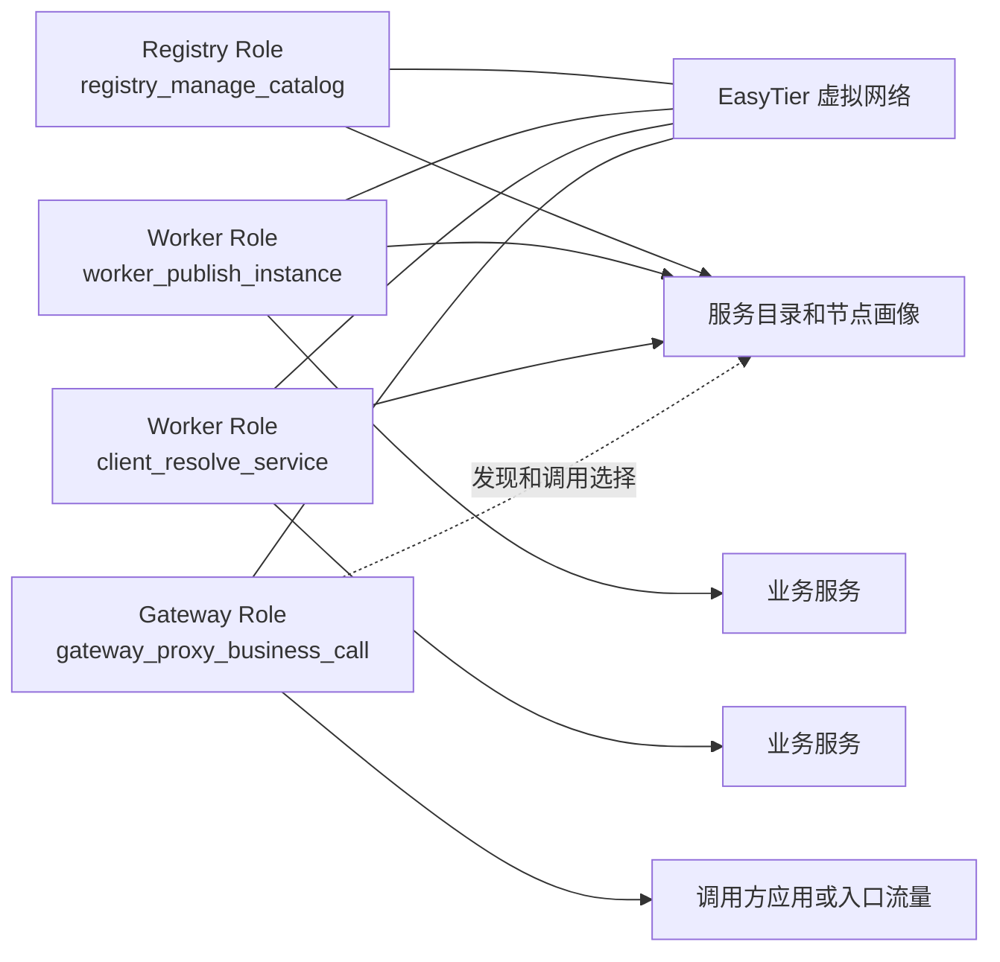
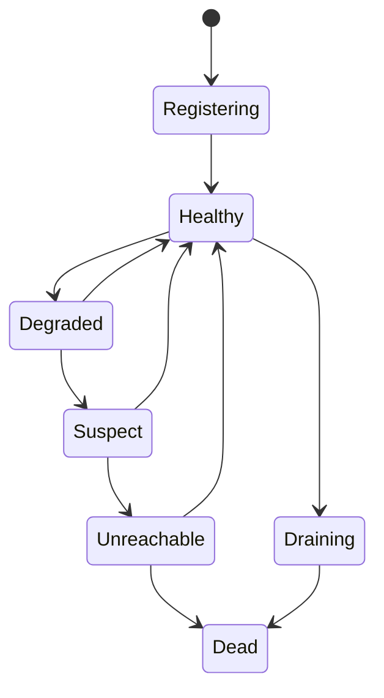
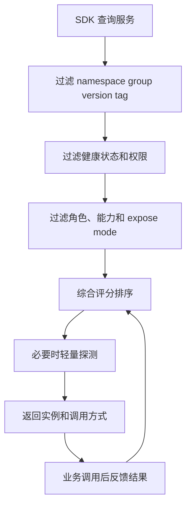

# 核心设计

本文档只保留技术无关、需要长期稳定的核心设计，不绑定具体语言、框架和部署包装形态。  
实现进度与阶段限制见 [实施方案](./service-registry-plan.md)；HTTP/SDK 契约见 [应用层](./service-registry-application-layer.md)。

## 1. 目标与边界

目标：

- 在 EasyTier 虚拟组网上提供服务注册、服务发现和弱网调度能力。
- 让调用方在网络波动、跨区域、跨 NAT、频繁切网的环境下仍能拿到合理候选实例。
- 让配置、ACL 和服务目录在多 registry 节点下以最终一致方式传播。

非目标：

- 不替代 EasyTier 的路由、打洞、relay 和虚拟网络实现。
- 不封装具体业务 RPC 协议。
- 不在首版追求多 registry 强一致。

## 2. 运行模式、角色与能力模型

这一轮开始，不再把 `A/B/C` 作为核心抽象，而改为三层模型：

- `Mode`（部署/生命周期模式：`sidecar` / `daemon` / `embedded`）
  - 描述进程如何承载；**daemon 不捆绑 EasyTier**，**sidecar/embedded 捆绑托管**
- `NodeRole`
  - 描述节点主要承担什么职责
- `CapabilityFlags`
  - 描述节点实际具备哪些能力

这样可以避免因为部署方式、网络附着方式或特殊职责增多，就把角色枚举无限膨胀。

### 2.1 Mode（原 RuntimeMode）

`Mode` 只描述 **业务如何挂接 runtime / EasyTier 生命周期与部署关系**，不表达控制面职责和业务权限。  
启动 **必传**：`--mode` / `ETDISCOVERY_MODE` / `EtDiscovery:Mode`。  
取值 **仅** `sidecar` | `daemon` | `embedded`。  
**不存在 `standalone` /「独立模式」**——旧称一律映射为 **`embedded`**。  
角色 × mode 矩阵与经典部署见 [应用 ↔ Runtime 交互 §16](./service-registry-app-runtime-interaction.md#16-mode-定义角色交叉矩阵与经典部署)；**代码不对组合做校验**。

- `sidecar`
  - 与业务进程或业务容器就近旁路（典型：K8s 同 Pod）
  - **捆绑托管** EasyTier（否则无人启动）
- `daemon`
  - **业务语义**：多个业务进程共享 **同一网络命名空间内** 一个 EtDiscovery 宿主
  - **不捆绑、不托管** EasyTier 生命周期：隧道由运维 **外置共享**（多服务共用 VIP）
  - **不是** Kubernetes `DaemonSet` 的同义词；大集群允许多套独立网络/daemon
- `embedded`
  - runtime 与宿主进程一体：业务内嵌，或 **本进程即 EtDiscovery**（含原 standalone，如 registry）
  - **捆绑托管** EasyTier；**registry+embedded 必须捆绑**
  - **roles 含 `registry` 时**：可选 `daemon`（外置隧道，少见）或 `embedded`（集群 **只用** 此）

约束：

- 同一 `NodeRole` 可运行在不同 `Mode` 下（矩阵见交互文档）。
- `Mode` 不直接决定目录权限；**是否由 EtDiscovery 托管 EasyTier** 由 `Mode` 解释。

### 2.2 NodeRole

`NodeRole` 只表达职责归属，不直接等同于最终权限：

- `registry`
  - 负责目录聚合、注册查询、配置传播、状态汇总与控制面接口
- `worker`
  - 负责服务提供方本地发布、续约、健康与元数据上报
- `client`
  - 负责服务消费方本地查询、选择、watch 与调用反馈
- `observer`
  - 负责观测、探测、怀疑票和诊断信息上报
- `gateway`
  - 负责作为公网暴露入口或跨网络入口，接收外部请求并代理业务调用
- `empty`
  - 表示未声明任何业务层角色
  - 对应 role flags 全 0 的默认状态

补充说明：

- `registry` 可以是纯控制面节点，也可以是连入 EasyTier 网络的普通 overlay 节点。
- `client` 恢复为正式角色，用来表达“消费方职责”，而不是再隐含塞进 `worker` 或 `empty`。
- `gateway` 是特殊入口角色，不再与 `client` 共用同一组能力名。
- `empty` 不是基础设施角色，也不承载额外网络语义；它只表示“当前没有声明任何角色”。
- `empty` 不允许与其他 `NodeRole` 叠加；一旦声明任意其他角色，该节点就不再是 `empty`。
- 如果后续确实需要显式标注 relay、中转或其他网络基础设施职责，应新增独立角色，而不是复用 `empty`。
- 一个节点允许同时承载多个非空 `NodeRole`，例如同机承担 `registry + worker`，或承担 `client + gateway`。

### 2.3 CapabilityFlags

`CapabilityFlags` 分为两类：

- 角色专属能力
  - 每个角色拥有自己独立命名的一组能力，不与其他角色共享
- 通用能力
  - 与具体角色无强绑定，可被多个角色复用

约束原则：

- 两个不同 `NodeRole` 不应共享同一个角色专属能力名。
- 如果某项能力可被多个角色复用，应提升为通用能力，而不是继续挂在某一个角色名下。
- 一个节点可同时承载多个角色，因此其最终能力集合是“多个角色专属能力 + 通用能力”的并集。

### 2.4 角色与能力矩阵

#### 2.4.1 角色专属能力矩阵

| NodeRole | 角色职责 | 角色专属能力 |
| --- | --- | --- |
| `registry` | 目录与控制面 | `registry_accept_registration` `registry_query_catalog` `registry_manage_catalog` `registry_distribute_config` `registry_aggregate_state` `registry_advertise_bootstrap` |
| `worker` | 服务提供方本地发布 | `worker_publish_instance` `worker_renew_instance` `worker_report_health` `worker_update_metadata` |
| `client` | 服务消费方本地发现 | `client_resolve_service` `client_select_instance` `client_watch_service` `client_report_feedback` |
| `observer` | 独立观测与诊断 | `observer_probe_node` `observer_emit_suspect_vote` `observer_publish_diagnostics` |
| `gateway` | 公网入口与代理调用 | `gateway_accept_ingress` `gateway_resolve_backend` `gateway_proxy_business_call` `gateway_route_fallback` |
| `empty` | 无角色声明 | 无业务层专属能力 |

#### 2.4.2 通用能力矩阵

这些能力不表达业务职责，只表达节点的基础设施属性，因此允许跨角色复用：

| 通用能力 | 含义 | 典型可附着角色 |
| --- | --- | --- |
| `network_attached` | 连入 EasyTier 或等价 overlay 网络 | `registry` `worker` `client` `observer` `gateway` |
| `overlay_identity` | 持有 overlay 身份与虚拟地址 | `registry` `worker` `client` `observer` `gateway` |
| `easytier_runtime_host` | 承载本地 EasyTier runtime | `registry` `worker` `client` `gateway` |
| `public_reachable` | 可从公网或跨域入口直接访问 | `registry` `gateway` |
| `persistent_storage` | 持有持久化状态或缓存 | `registry` `observer` |

补充约束：

- 这些通用能力描述基础设施属性，不单独决定业务角色。
- `empty` 不因为拥有某项通用能力就自动获得业务语义；如果某项基础设施职责必须被上层显式识别，应提升为新的独立 `NodeRole`。

#### 2.4.3 推荐角色组合示例

| 组合 | 典型含义 | 角色专属能力 | 通用能力 |
| --- | --- | --- | --- |
| `registry` | 纯控制面 registry | `registry_*` | 可选 `persistent_storage` |
| `registry` | 连入 overlay 的 registry 节点 | `registry_*` | `network_attached` `overlay_identity` `easytier_runtime_host` |
| `worker` | provider 本地 runtime | `worker_*` | `network_attached` `overlay_identity` `easytier_runtime_host` |
| `client` | consumer 本地 runtime | `client_*` | `network_attached` `overlay_identity` `easytier_runtime_host` |
| `client + gateway` | 具备入口代理能力的特殊消费方 | `client_*` `gateway_*` | `network_attached` `overlay_identity` `public_reachable` |
| `observer` | 纯观测基础设施节点 | `observer_*` | `network_attached` `overlay_identity` `persistent_storage` |

保留约束：

- `empty` 不携带任何业务层专属能力，也不能与其他角色叠加。
- `gateway` 不再直接复用 `client_select_instance` 这类 client 能力，而使用自己的 `gateway_*` 能力集合。
- `worker` 不再承担消费方职责；消费方职责由 `client` 角色明确表达。
- 某节点若同时承担 `worker + client`，应显式同时声明两组角色，而不是用一个共享能力集合折中表达。
- 如果未来需要显式表达 relay / transit / forwarder 等基础设施职责，应新增独立角色，而不是给 `empty` 增加语义。

## 3. 总体架构

## 4. 控制面与数据面

控制面负责：

- 服务注册、续约、注销
- 服务发现与 watch
- 配置与 ACL 传播
- 节点画像、链路画像和状态聚合

数据面负责：

- 业务方按推荐结果直连目标实例
- 在必要时选择 relay、代理或其他调用方式

关键边界：

- SDK 返回“选谁、怎么连、为什么选它”。
- 业务客户端自己决定是否发起调用、是否重试、如何熔断。

## 5. 服务注册模型

### 5.1 核心实体

`ServiceDefinition`

- 标识服务逻辑定义。
- 关心 `namespace`、`service_name`、`protocol`、`version`、`group`、`tags`。
- 记录 `routing_policy`、`owner_node_id`、`config_epoch`、`acl_policy_ref`。

`ServiceInstance`

- 标识一个实际可调用实例。
- 关心 `instance_id`、`node_id`、`virtual_ip`、`port`、`protocol`、`weight`。
- 记录 `lease_id`、`lease_epoch`、`health_state`、`expose_mode`。

`NodeProfile`

- 描述节点静态与半静态能力。
- 包含 `runtime_mode`、`node_roles`、`capability_flags`、网络类型、NAT 类型、虚拟 IP、特性开关、拓扑标签、资源分和稳定性分。

`LinkProfile`

- 描述两个节点之间的链路质量。
- 包含 `next_hop`、`hop_count`、`path_latency`、`loss_rate`、`jitter_ms` 和路由策略。

`ConfigRecord`

- 描述配置或 ACL 的所有权与传播状态。
- 记录 `owner_node_id`、`owner_home_a`、`epoch`、`signature_chain`、`acknowledgment_state`、`valid_until`。

### 5.2 配置与 ACL 所有权模型

核心原则：

- 配置和 ACL 不追求全局瞬时一致。
- 必须记录“谁创建、谁确认、从哪里传播而来”。
- owner 是最高权威，home registry 是传播主代理。

传播规则：

- owner 创建配置后先上报给 home registry。
- 其他 registry 节点可同步并缓存，但不能抹掉 owner 和确认链信息。
- 非 owner 修改先作为临时配置存在，再等待 owner 承认。
- 跨区域冲突不做简单覆盖，进入 `conflicted` 状态等待明确决策。

配置有效性可粗分为：

- `owner_ack`
- `home_a_ack`
- `regional_ack`
- `temporary_local`
- `stale_remote`

## 6. 健康检查与状态机

### 6.1 三段式租约

- `ttl_healthy`：正常续约窗口。
- `ttl_suspect`：续约超时但仍保留为可疑或降级状态。
- `ttl_delete`：长期失联且多信号确认后进入删除或死亡。

### 6.2 状态迁移

### 6.3 健康信号来源

- 注册信号：注册、续约、注销、draining
- 应用信号：业务健康检查、负载、依赖状态
- 网络信号：路由、延迟、丢包、NAT、连接状态
- 观察者信号：具备 `observer_probe_node` 角色专属能力，或承担 `observer` 角色的节点主动探测结果
- 调用反馈：真实 RPC 成功率、超时、拒绝、熔断

### 6.4 判定原则

- 控制面断连不等于实例死亡。
- 单一健康信号异常不直接判死。
- 只有多信号叠加且持续超阈值时才进入 `unreachable` 或 `dead`。
- 服务列表突然归零时需要空保护，短时保留历史可达候选。

## 7. 多观察者怀疑投票

借鉴 Orleans 的思路，采用“怀疑票”而不是单点判死。

规则：

- 每个目标节点分配多个观察者。
- 观察者优先选稳定的 `observer` 节点，其次才是承担辅助观测职责的 `registry` 节点。
- 连续探测失败达到阈值后产生 `suspect vote`。
- 怀疑票带过期时间，过期自动失效。
- 来自同一故障域的怀疑票应降权。

建议约束：

- `observer -> worker` 的怀疑票权重大于其他角色的辅助探测结果。
- 纯 `client` 节点不参与死亡投票，只贡献 `client_report_feedback`。
- 目标节点仍能续约时，不应直接进入 `dead`。

## 8. 可用性评分

### 8.1 评分维度

`NodeAvailabilityScore` 建议范围为 `0..100`，由以下维度组合：

- 租约新鲜度
- 应用健康
- 路由可达性
- 延迟与丢包
- NAT 与打洞概率
- 角色基准
- 历史稳定性
- 观察者怀疑分布
- 真实调用反馈

### 8.2 角色与能力权重建议

| 维度 | `registry` | `worker` | `client` | `gateway` | `observer` |
| --- | ---: | ---: | ---: | ---: | ---: |
| 租约新鲜度 | 15 | 15 | 0 | 10 | 5 |
| 应用健康 | 10 | 25 | 0 | 10 | 0 |
| 路由可达 | 20 | 20 | 15 | 15 | 15 |
| 延迟丢包 | 10 | 20 | 20 | 20 | 10 |
| NAT 与打洞概率 | 5 | 10 | 15 | 15 | 5 |
| 角色与稳定性 | 25 | 5 | 5 | 10 | 20 |
| 调用反馈 | 0 | 5 | 20 | 20 | 0 |
| 代理调用代价 | 0 | 0 | 0 | 10 | 0 |

补充约束：

- `worker` 默认是主要服务候选。
- `registry` 可作为稳定控制面或兜底基础设施，但不应天然压过专职 `worker` 服务节点。
- `client` 默认是消费方，而不是服务提供候选。
- `gateway` 参与被调方候选时，应显式体现代理转发额外代价。
- `observer` 默认不进入普通业务服务候选。
- `empty` 不是候选角色，它只代表“无角色声明”。

## 9. 实例选择算法

### 9.1 查询流程

### 9.2 候选过滤

强过滤：

- 服务名、协议、命名空间、分组必须匹配
- ACL 和租户约束必须满足
- `dead`、`draining`、`disabled` 默认不返回
- 不具备 `worker_publish_instance` 角色专属能力的节点默认不返回
- `gateway` 只有在显式声明入口代理服务时才进入候选
- 违反调用方网络策略的实例直接过滤

弱过滤：

- `suspect`、`degraded` 作为备用候选
- 高延迟、高丢包实例降权
- 双方对称 NAT 时优先 relay 路径

### 9.3 综合评分公式

建议公式：

`endpoint_score = availability_score * role_factor * capability_factor * network_factor * locality_factor * business_weight * circuit_factor * stickiness_factor * proxy_factor`

其中：

- `availability_score`：来自可用性评分
- `role_factor`：按 `node_roles` 或其归一化组合调整
- `capability_factor`：按 `capability_flags` 调整
- `network_factor`：NAT、直连/relay、链路质量
- `locality_factor`：物理区域、运营商、zone、虚拟网络距离
- `business_weight`：业务注册权重
- `circuit_factor`：熔断状态
- `stickiness_factor`：会话/Actor/缓存亲和
- `proxy_factor`：经由 `gateway` 代理调用时的额外代价或收益

### 9.4 选择策略

- `latency_first`
- `stability_first`
- `cost_first`
- `role_first`
- `gateway_first`
- `actor_sticky`
- `failover_chain`

## 10. 首版稳定边界

建议在后续讨论中默认把下面内容视作“稳定核心”：

- Mode / NodeRole / CapabilityFlags 三层模型
- 服务定义、实例、节点、链路、配置五类核心实体
- 拓扑所有权与 owner 确认链
- 三段式租约与状态机
- 多观察者怀疑投票
- 评分驱动的实例选择，而非业务 RPC 代理
