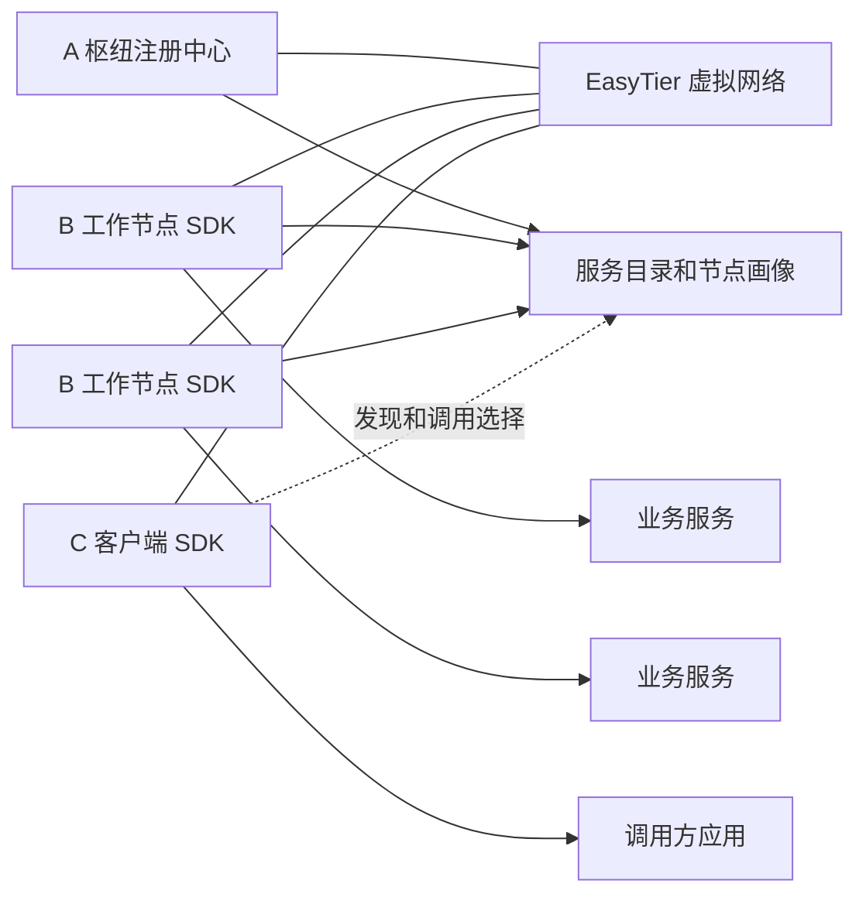
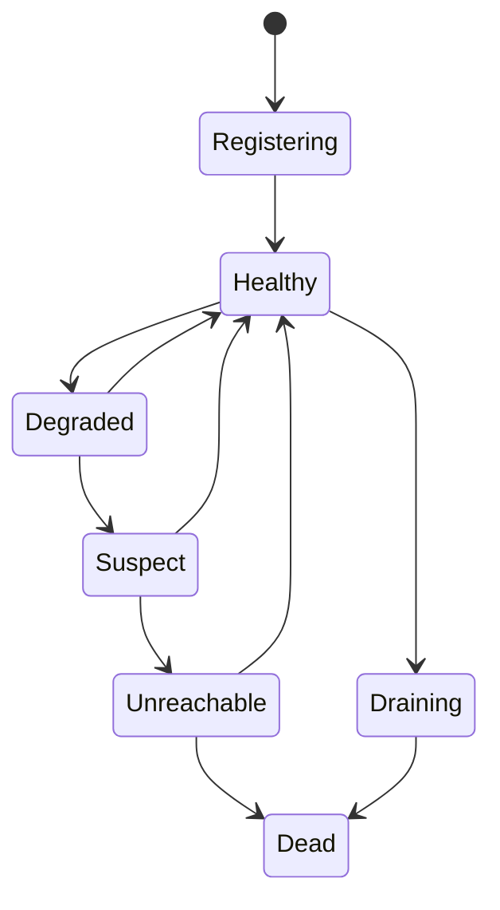
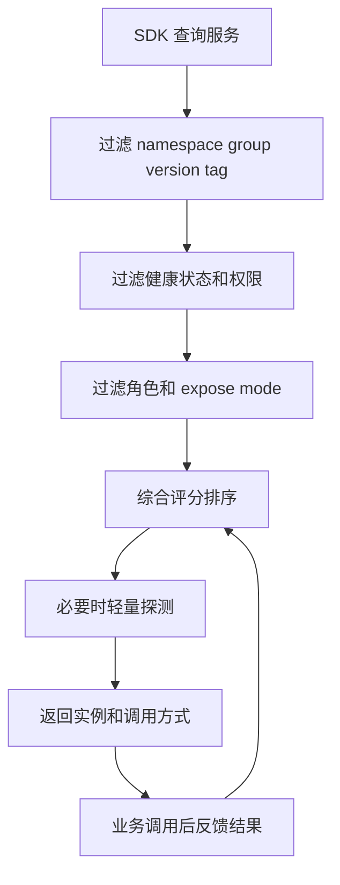

# 核心设计

本文档只保留技术无关、需要长期稳定的核心设计，不绑定具体语言、框架和部署包装形态。

## 1. 目标与边界

目标：

- 在 EasyTier 虚拟组网上提供服务注册、服务发现和弱网调度能力。
- 让调用方在网络波动、跨区域、跨 NAT、频繁切网的环境下仍能拿到合理候选实例。
- 让配置、ACL 和服务目录在多 A 节点下以最终一致方式传播。

非目标：

- 不替代 EasyTier 的路由、打洞、relay 和虚拟网络实现。
- 不封装具体业务 RPC 协议。
- 不在首版追求多 A 强一致。

## 2. 角色模型

### 2.1 A/B/C 三类角色

`A` 类注册中心：

- 运行在相对稳定的枢纽节点。
- 负责注册、续约、服务目录聚合、配置同步、健康状态汇总、怀疑票汇总和查询接口。
- 可兼任公网入口、relay 或控制面观察者。

`B` 类工作节点：

- 通常是服务提供方。
- 负责上报服务实例、租约、健康状态和调用反馈。
- 在授权情况下可承担代理中转、relay 候选或 Actor 承载角色。

`C` 类客户端：

- 默认是调用方，不默认作为服务提供方。
- 可临时加入网络，适配移动网络和弱网场景。
- 主要负责服务发现、实例选择、失败反馈和缓存降级。

### 2.2 角色约束

- `A` 更偏控制面和稳定兜底节点。
- `B` 是首选服务提供方。
- `C` 只有在显式声明能力时才进入服务提供候选。

## 3. 总体架构

## 4. 控制面与数据面

控制面负责：

- 服务注册、续约、注销
- 服务发现与 watch
- 配置与 ACL 传播
- 节点画像、链路画像和状态聚合

数据面负责：

- 业务方按推荐结果直连目标实例
- 在必要时选择 relay、代理或其他调用方式

关键边界：

- SDK 返回“选谁、怎么连、为什么选它”。
- 业务客户端自己决定是否发起调用、是否重试、如何熔断。

## 5. 服务注册模型

### 5.1 核心实体

`ServiceDefinition`

- 标识服务逻辑定义。
- 关心 `namespace`、`service_name`、`protocol`、`version`、`group`、`tags`。
- 记录 `routing_policy`、`owner_node_id`、`config_epoch`、`acl_policy_ref`。

`ServiceInstance`

- 标识一个实际可调用实例。
- 关心 `instance_id`、`node_id`、`virtual_ip`、`port`、`protocol`、`weight`。
- 记录 `lease_id`、`lease_epoch`、`health_state`、`expose_mode`。

`NodeProfile`

- 描述节点静态与半静态能力。
- 包含角色、网络类型、NAT 类型、虚拟 IP、特性开关、拓扑标签、资源分和稳定性分。

`LinkProfile`

- 描述两个节点之间的链路质量。
- 包含 `next_hop`、`hop_count`、`path_latency`、`loss_rate`、`jitter_ms` 和路由策略。

`ConfigRecord`

- 描述配置或 ACL 的所有权与传播状态。
- 记录 `owner_node_id`、`owner_home_a`、`epoch`、`signature_chain`、`acknowledgment_state`、`valid_until`。

### 5.2 配置与 ACL 所有权模型

核心原则：

- 配置和 ACL 不追求全局瞬时一致。
- 必须记录“谁创建、谁确认、从哪里传播而来”。
- owner 是最高权威，home A 是传播主代理。

传播规则：

- owner 创建配置后先上报给 home A。
- 其他 A 可同步并缓存，但不能抹掉 owner 和确认链信息。
- 非 owner 修改先作为临时配置存在，再等待 owner 承认。
- 跨区域冲突不做简单覆盖，进入 `conflicted` 状态等待明确决策。

配置有效性可粗分为：

- `owner_ack`
- `home_a_ack`
- `regional_ack`
- `temporary_local`
- `stale_remote`

## 6. 健康检查与状态机

### 6.1 三段式租约

- `ttl_healthy`：正常续约窗口。
- `ttl_suspect`：续约超时但仍保留为可疑或降级状态。
- `ttl_delete`：长期失联且多信号确认后进入删除或死亡。

### 6.2 状态迁移

### 6.3 健康信号来源

- 注册信号：注册、续约、注销、draining
- 应用信号：业务健康检查、负载、依赖状态
- 网络信号：路由、延迟、丢包、NAT、连接状态
- 观察者信号：A/B 节点主动探测结果
- 调用反馈：真实 RPC 成功率、超时、拒绝、熔断

### 6.4 判定原则

- 控制面断连不等于实例死亡。
- 单一健康信号异常不直接判死。
- 只有多信号叠加且持续超阈值时才进入 `unreachable` 或 `dead`。
- 服务列表突然归零时需要空保护，短时保留历史可达候选。

## 7. 多观察者怀疑投票

借鉴 Orleans 的思路，采用“怀疑票”而不是单点判死。

规则：

- 每个目标节点分配多个观察者。
- 观察者优先选稳定的 `A` 和 `B` 节点。
- 连续探测失败达到阈值后产生 `suspect vote`。
- 怀疑票带过期时间，过期自动失效。
- 来自同一故障域的怀疑票应降权。

建议约束：

- `A -> B` 的怀疑票权重大于普通 `B -> B`。
- `C` 节点不参与死亡投票，只贡献调用反馈。
- 目标节点仍能续约时，不应直接进入 `dead`。

## 8. 可用性评分

### 8.1 评分维度

`NodeAvailabilityScore` 建议范围为 `0..100`，由以下维度组合：

- 租约新鲜度
- 应用健康
- 路由可达性
- 延迟与丢包
- NAT 与打洞概率
- 角色基准
- 历史稳定性
- 观察者怀疑分布
- 真实调用反馈

### 8.2 角色权重建议

| 维度 | A 节点 | B 节点 | C 节点 |
| --- | ---: | ---: | ---: |
| 租约新鲜度 | 15 | 15 | 10 |
| 应用健康 | 20 | 25 | 10 |
| 路由可达 | 20 | 20 | 15 |
| 延迟丢包 | 15 | 20 | 20 |
| NAT 与打洞概率 | 10 | 10 | 20 |
| 角色与稳定性 | 15 | 5 | 20 |
| 调用反馈 | 5 | 5 | 5 |

补充约束：

- `B` 默认是主要服务候选。
- `A` 可作为稳定兜底，但不应天然压过所有 `B`。
- `C` 作为被调用方时应附加明显惩罚。

## 9. 实例选择算法

### 9.1 查询流程

### 9.2 候选过滤

强过滤：

- 服务名、协议、命名空间、分组必须匹配
- ACL 和租户约束必须满足
- `dead`、`draining`、`disabled` 默认不返回
- `C` 提供的实例默认不返回
- 违反调用方网络策略的实例直接过滤

弱过滤：

- `suspect`、`degraded` 作为备用候选
- 高延迟、高丢包实例降权
- 双方对称 NAT 时优先 relay 路径

### 9.3 综合评分公式

建议公式：

`endpoint_score = availability_score * role_factor * network_factor * locality_factor * business_weight * circuit_factor * stickiness_factor`

其中：

- `availability_score`：来自可用性评分
- `role_factor`：A/B/C 调整
- `network_factor`：NAT、直连/relay、链路质量
- `locality_factor`：物理区域、运营商、zone、虚拟网络距离
- `business_weight`：业务注册权重
- `circuit_factor`：熔断状态
- `stickiness_factor`：会话/Actor/缓存亲和

### 9.4 选择策略

- `latency_first`
- `stability_first`
- `cost_first`
- `role_first`
- `actor_sticky`
- `failover_chain`

## 10. 首版稳定边界

建议在后续讨论中默认把下面内容视作“稳定核心”：

- A/B/C 角色模型
- 服务定义、实例、节点、链路、配置五类核心实体
- 拓扑所有权与 owner 确认链
- 三段式租约与状态机
- 多观察者怀疑投票
- 评分驱动的实例选择，而非业务 RPC 代理
